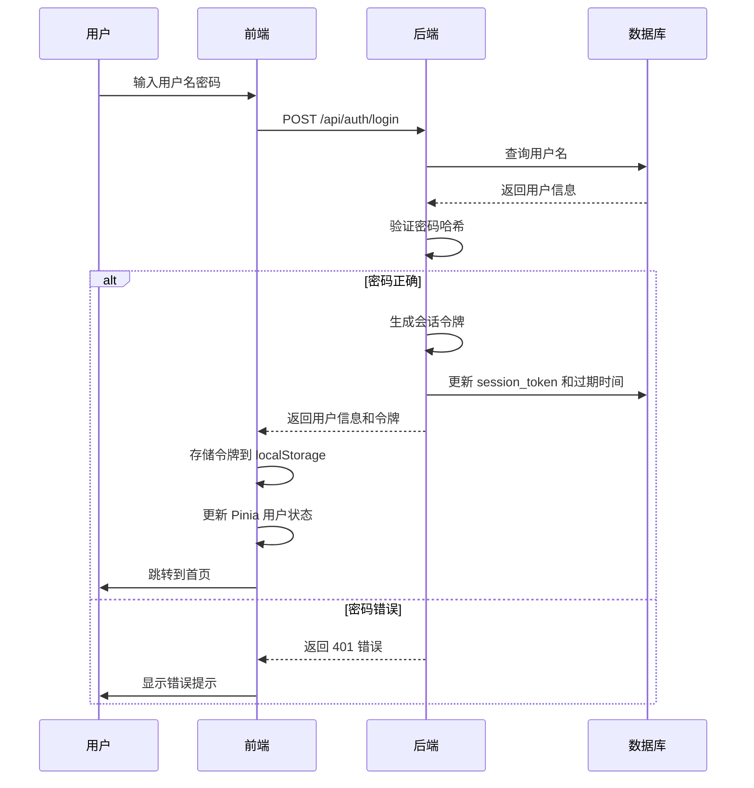
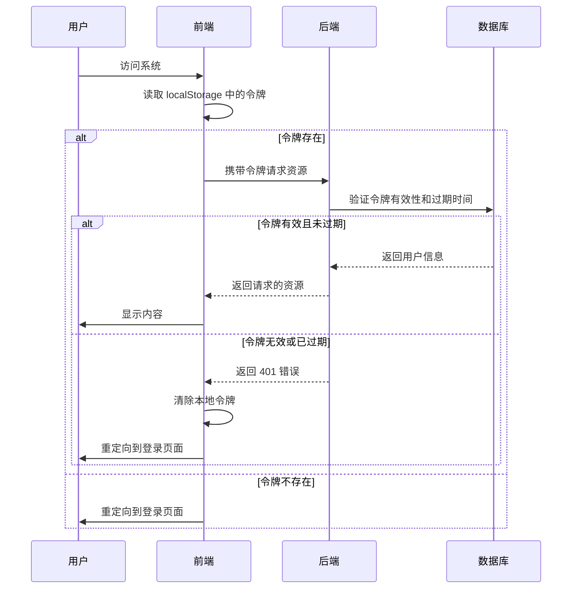
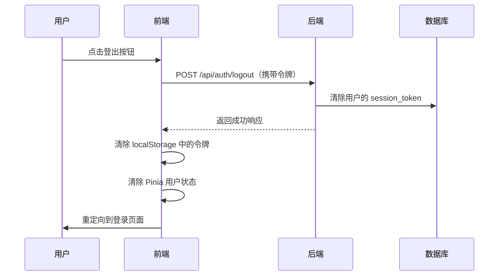

# 登录系统设计

## 功能目标

为外挂大脑添加账号密码登录功能，与现有的微信登录并存，提供独立的登录页面作为系统访问入口，支持记住登录状态30天内自动登录。

## 业务场景

### 登录流程

用户访问系统时，若未登录或登录已过期，将被重定向到登录页面。用户可选择账号密码登录或微信登录两种方式进行身份认证。

### 自动登录机制

用户成功登录后，系统在本地存储会话令牌，30天内再次访问时自动使用该令牌完成身份验证，无需重复登录。

### 登出机制

用户可主动登出，清除本地存储的会话令牌和服务端的会话记录，下次访问需重新登录。

## 数据模型

### users 表扩展

在现有 users 表基础上增加账号密码字段：

| 字段名 | 类型 | 约束 | 说明 |
|--------|------|------|------|
| username | TEXT | UNIQUE | 用户名，用于账号密码登录 |
| password_hash | TEXT | - | 密码哈希值，使用 bcrypt 加密存储 |

### 默认用户数据

系统初始化时创建默认管理员账号：

| 字段 | 值 |
|------|-----|
| username | admin |
| password | admin（存储时转为哈希值） |
| openid | NULL（账号密码登录用户无 openid） |

## 系统架构

### 前端层

**路由守卫**

在 Vue Router 中增加全局前置守卫，拦截所有需要认证的路由，检查本地存储的会话令牌：
- 若令牌存在且有效，允许访问
- 若令牌不存在或无效，重定向到登录页面

**登录页面组件**

提供两个登录选项的独立页面：
- 账号密码登录表单（用户名输入框、密码输入框、登录按钮）
- 微信登录按钮

**状态管理**

在 Pinia 中创建用户状态模块，管理：
- 当前登录用户信息
- 会话令牌
- 登录状态

**API 请求拦截器增强**

在现有 axios 拦截器中增加逻辑：
- 请求拦截器：自动从本地存储读取令牌并添加到请求头
- 响应拦截器：捕获 401 未授权响应，清除本地令牌并跳转登录页面

### 后端层

**认证路由扩展**

在现有 `/api/auth` 路由组下新增账号密码登录端点：
- 接收用户名和密码
- 验证用户凭据
- 生成会话令牌
- 返回用户信息和令牌

**登出路由**

新增登出端点，用于清除服务端会话记录。

**认证中间件复用**

现有的 `requireUser` 中间件无需修改，已支持通过令牌获取用户信息。

### 数据层

**用户模型扩展**

新增数据库操作方法：
- 根据用户名查询用户
- 创建账号密码用户
- 验证用户密码
- 清除用户会话令牌

**数据库初始化扩展**

在现有数据库初始化流程中增加：
- users 表字段迁移（添加 username 和 password_hash）
- 创建默认 admin 用户
- 为 username 字段创建唯一索引

## 核心流程

### 账号密码登录流程

### 自动登录流程

### 登出流程

## 安全策略

### 密码加密

使用 bcrypt 算法对密码进行单向哈希加密，加密强度因子设置为 10，确保即使数据库泄露也无法反推明文密码。

### 令牌安全

- 会话令牌使用 crypto.randomBytes 生成 32 字节随机字符串，转为 64 位十六进制
- 令牌存储在数据库中，与用户 ID 关联
- 每次登录生成新令牌，替换旧令牌
- 令牌传输通过 Authorization 请求头或 x-session-token 自定义头

### 防暴力破解

前端实现基础的登录错误提示，不区分用户名不存在或密码错误，统一返回"用户名或密码错误"。

### HTTPS 传输

生产环境必须使用 HTTPS 协议，防止令牌和密码在传输过程中被窃取。

## 兼容性设计

### 与微信登录共存

- 账号密码登录和微信登录共用 users 表和会话机制
- 账号密码用户的 openid 字段为 NULL
- 微信登录用户可选择是否设置用户名密码，实现账号绑定

### 现有数据迁移

- 现有通过 openid 登录的用户数据保持不变
- 新增字段使用 ALTER TABLE 添加，不影响现有记录
- 数据库初始化逻辑向后兼容，检查字段是否存在后再添加

### 匿名访问兼容

现有的匿名访问机制（通过 `DISABLE_ANON` 环境变量控制）保持不变，认证中间件的逻辑无需调整。

## API 接口规范

### 账号密码登录接口

**请求**

- 方法：POST
- 路径：/api/auth/login
- 请求体结构：

| 字段名 | 类型 | 必填 | 说明 |
|--------|------|------|------|
| username | string | 是 | 用户名 |
| password | string | 是 | 密码明文 |

**响应**

成功（200）：

| 字段名 | 类型 | 说明 |
|--------|------|------|
| user_id | integer | 用户 ID |
| username | string | 用户名 |
| token | string | 会话令牌 |
| expires_at | string | 令牌过期时间（ISO 8601 格式） |

失败（401）：

| 字段名 | 类型 | 说明 |
|--------|------|------|
| error | string | 错误描述 |

### 登出接口

**请求**

- 方法：POST
- 路径：/api/auth/logout
- 请求头：Authorization: Bearer {token} 或 x-session-token: {token}

**响应**

成功（200）：

| 字段名 | 类型 | 说明 |
|--------|------|------|
| message | string | 成功消息 |

失败（401）：

| 字段名 | 类型 | 说明 |
|--------|------|------|
| error | string | 错误描述 |

## 配置参数

### 环境变量

| 变量名 | 默认值 | 说明 |
|--------|--------|------|
| SESSION_DAYS | 30 | 会话令牌有效天数 |
| DISABLE_ANON | false | 是否禁用匿名访问 |
| DEFAULT_ADMIN_USERNAME | admin | 默认管理员用户名 |
| DEFAULT_ADMIN_PASSWORD | admin | 默认管理员密码 |

### 前端配置

| 配置项 | 值 | 说明 |
|--------|-----|------|
| tokenStorageKey | 'auth_token' | 令牌在 localStorage 中的键名 |
| loginPath | '/login' | 登录页面路由路径 |
| defaultRedirect | '/' | 登录成功后的默认跳转路径 |

## 实现优先级

### 第一阶段：核心登录功能

1. 数据库 users 表字段扩展和迁移脚本
2. 默认 admin 用户初始化
3. 后端账号密码登录路由实现
4. 用户模型的密码验证方法
5. 前端登录页面组件
6. 前端用户状态 Pinia store

### 第二阶段：自动登录和会话管理

1. 前端路由守卫实现
2. axios 拦截器增强
3. 本地令牌存储和读取
4. 后端登出路由实现
5. 前端登出功能

### 第三阶段：优化和完善

1. 登录错误提示优化
2. 登录页面样式美化
3. 密码强度校验（可选）
4. 记住用户名功能（可选）

## 测试验证点

### 功能测试

- 使用 admin/admin 可成功登录
- 登录后跳转到首页，可正常访问各功能
- 关闭浏览器重新打开，30天内自动登录
- 点击登出后，需重新登录才能访问
- 错误的用户名或密码无法登录，显示提示信息
- 微信登录仍然可用，与账号密码登录不冲突

### 安全测试

- 数据库中的密码字段为哈希值，非明文
- 令牌在 30 天后自动失效
- 未登录时访问受保护路由会被重定向到登录页
- 使用无效令牌请求 API 返回 401 错误

### 兼容性测试

- 现有微信登录用户数据不受影响
- 数据库初始化在新旧环境中都能正常运行
- 现有的内容、标签等功能在新登录系统下正常工作

## 风险评估

### 技术风险

**风险**：数据库迁移可能影响现有用户数据

**缓解措施**：在 ALTER TABLE 前进行字段存在性检查，使用可选字段（允许 NULL），确保向后兼容

### 安全风险

**风险**：默认密码 admin/admin 过于简单，易被猜测

**缓解措施**：在用户指南中强烈建议首次登录后修改密码（后续版本可强制修改）

### 用户体验风险

**风险**：新增登录页面可能增加使用门槛

**缓解措施**：保留 30 天自动登录，大多数情况下用户无需重复登录；保留匿名访问选项供开发测试使用
**缓解措施**：保留 30 天自动登录，大多数情况下用户无需重复登录；保留匿名访问选项供开发测试使用