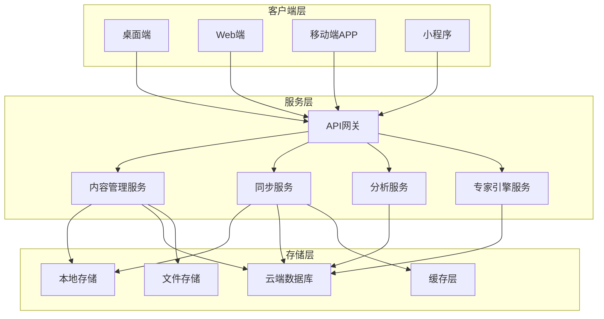
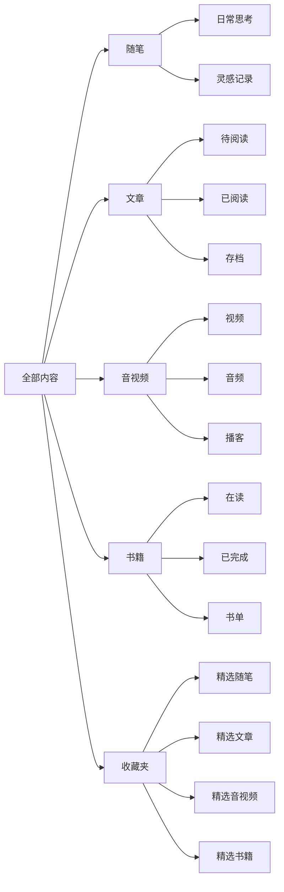
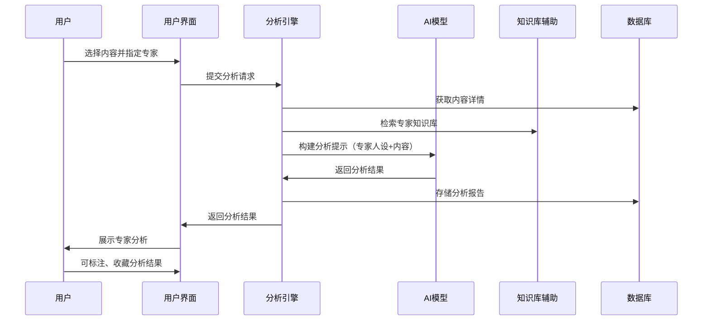
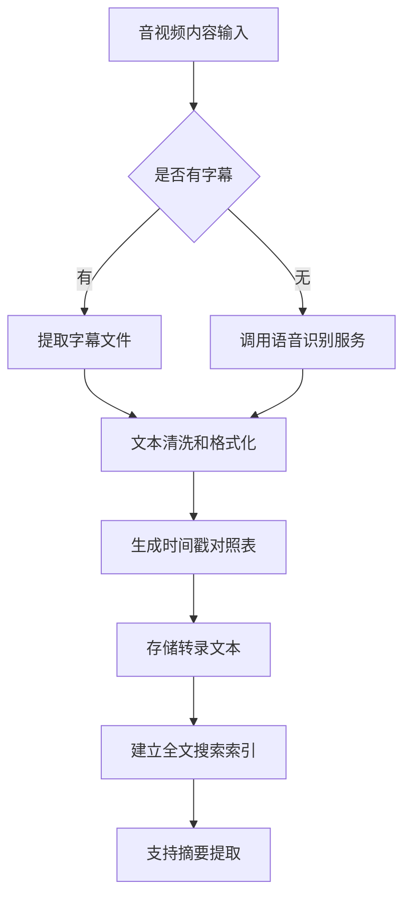
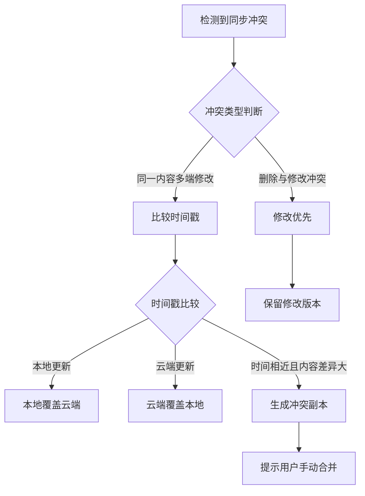

# 外挂大脑设计文档

## 1. 系统概述

### 1.1 系统定位
外挂大脑是一个个人知识管理系统，旨在帮助用户记录、整理、筛选和分析日常见闻，通过多维度内容分类和智能专家分析功能，构建个人的第二大脑知识库。

### 1.2 核心价值
- 多元化内容管理：支持随笔、文章、音视频、书籍等多种内容形式
- 智能化筛选机制：通过标签、评分等多维度自动筛选优质内容
- 专家视角分析：模拟不同领域专家的思维模式进行内容分析
- 跨平台同步：本地存储与云端同步相结合，支持多端访问

### 1.3 目标用户
热衷于知识积累、需要系统化管理个人见闻、期望从多角度分析问题的个人用户

## 2. 系统架构设计

### 2.1 架构模式
采用客户端-服务端混合架构，支持本地优先策略和云端同步机制

### 2.2 核心模块划分

| 模块名称 | 职责描述 | 主要功能 |
|---------|---------|---------|
| 内容采集模块 | 负责多源内容的录入和导入 | 支持手动录入、网页剪藏、文件导入、链接解析 |
| 内容管理模块 | 管理各类内容的存储和组织 | 分类存储、元数据管理、版本控制 |
| 筛选引擎模块 | 实现智能筛选和收藏机制 | 多维度评分、自动分类、收藏管理 |
| 同步协调模块 | 处理本地与云端的数据同步 | 增量同步、冲突解决、离线支持 |
| 专家分析模块 | 提供专家视角的内容分析 | 专家人设管理、分析引擎、结果展示 |
| 搜索检索模块 | 提供全文搜索和高级检索 | 全文索引、标签检索、时间轴检索 |
| 用户界面模块 | 多端统一的用户交互界面 | 响应式设计、离线模式、主题定制 |

## 3. 内容分类体系设计

### 3.1 内容类型定义

#### 3.1.1 随笔
- **定义**：用户日常的思考、感悟、灵感记录
- **核心属性**：
  - 标题（可选）
  - 正文内容
  - 创建时间
  - 修改时间
  - 标签集合
  - 情绪标记
  - 关联内容引用

#### 3.1.2 文章
- **定义**：从外部来源阅读的文章内容
- **核心属性**：
  - 文章标题
  - 原文链接
  - 作者信息
  - 发布时间
  - 内容摘要
  - 全文存档（可选）
  - 阅读进度
  - 批注笔记
  - 来源平台

#### 3.1.3 音视频
- **定义**：音频或视频形式的内容
- **核心属性**：
  - 资源标题
  - 原始链接
  - 本地文件路径（可选）
  - 时长
  - 创作者
  - 文字转录内容
  - 关键帧截图
  - 时间戳笔记
  - 观看/收听进度

#### 3.1.4 书籍
- **定义**：书籍阅读相关的信息和笔记
- **核心属性**：
  - 书名
  - 作者
  - ISBN
  - 出版信息
  - 阅读状态（未读/在读/已读）
  - 阅读进度（页码/章节）
  - 读书笔记
  - 书摘引用
  - 评分

### 3.2 内容组织结构

## 4. 内容筛选与收藏机制

### 4.1 筛选维度设计

| 筛选维度 | 数据来源 | 权重占比 | 说明 |
|---------|---------|---------|------|
| 用户手动评分 | 用户主动打分（1-5星） | 40% | 最直接的价值判断 |
| 访问频次 | 系统统计打开次数 | 20% | 反映内容受关注程度 |
| 停留时长 | 系统记录阅读/观看时间 | 15% | 衡量深度参与度 |
| 标签丰富度 | 标签数量和质量 | 10% | 反映内容的系统化程度 |
| 批注密度 | 笔记和批注的数量 | 10% | 体现思考深度 |
| 分享转发 | 分享到外部的次数 | 5% | 衡量传播价值 |

### 4.2 筛选算法策略

**综合评分计算公式**：
内容价值分 = 手动评分×0.4 + 归一化访问频次×0.2 + 归一化停留时长×0.15 + 标签评分×0.1 + 批注评分×0.1 + 分享评分×0.05

**自动收藏触发条件**：
- 综合评分 ≥ 4.0分（满分5分）
- 或手动评分 = 5星
- 或访问频次 ≥ 5次 且 平均停留时长 ≥ 阈值
- 或用户手动标记为收藏

### 4.3 收藏管理机制

#### 4.3.1 收藏夹结构
- 采用独立存储空间，与原内容保持引用关系
- 支持自定义收藏夹分类
- 收藏内容保留原始分类标签
- 支持收藏夹内的二次筛选和排序

#### 4.3.2 收藏状态同步
- 收藏操作实时同步到云端
- 跨设备收藏状态保持一致
- 取消收藏不删除原内容，仅移除收藏标记

## 5. 专家分析系统设计

### 5.1 专家人设体系

#### 5.1.1 预设专家配置

| 专家名称 | 思维特点 | 分析领域 | 核心方法论 |
|---------|---------|---------|-----------|
| 毛泽东 | 辩证思维、群众路线、实践检验 | 战略规划、问题分析、组织管理 | 矛盾分析法、调查研究、实事求是 |
| 马斯克 | 第一性原理、跨界创新、目标导向 | 技术创新、商业模式、效率优化 | 第一性原理推理、逆向思维、快速迭代 |
| 查理·芒格 | 多元思维模型、逆向思考、跨学科 | 投资决策、风险评估、认知升级 | 多学科格栅理论、检查清单法、逆向工程 |
| 费曼 | 简化复杂、类比思维、本质追问 | 学习方法、知识理解、概念澄清 | 费曼学习法、类比解释、还原本质 |

#### 5.1.2 专家人设可扩展性
- 系统支持管理员添加自定义专家
- 每个专家包含：姓名、简介、思维特点描述、分析提示模板、知识库参考资料
- 支持用户根据场景选择多个专家进行对比分析

### 5.2 分析引擎设计

#### 5.2.1 分析触发机制
- 用户主动选择内容请求专家分析
- 支持单个或批量内容分析
- 可选择单个专家或多专家对比视角

#### 5.2.2 分析流程

#### 5.2.3 人工标注与智能辅助结合
- **智能初筛**：AI模型根据专家人设进行初步分析
- **人工校验**：用户可对分析结果进行确认和调整
- **反馈学习**：用户标注的优质分析案例纳入专家知识库
- **提示优化**：基于历史分析效果持续优化专家提示模板

### 5.3 分析结果管理

#### 5.3.1 结果存储
- 每次分析生成独立的分析报告
- 报告关联原始内容、分析时间、使用的专家、AI模型版本
- 支持历史分析记录查询和对比

#### 5.3.2 结果展示
- 结构化展示分析要点（关键洞察、建议行动、延伸思考）
- 支持多专家分析结果的并列对比视图
- 分析结果可导出为独立文档

## 6. 音视频内容处理方案

### 6.1 存储策略

| 处理方式 | 适用场景 | 存储内容 | 优先级 |
|---------|---------|---------|-------|
| 仅链接模式 | 在线平台内容（YouTube、B站等） | URL、封面图、元数据 | 高 |
| 转录文本模式 | 需深度分析的音视频 | 完整文字转录、时间戳对照 | 高 |
| 本地存档模式 | 重要且担心失效的内容 | 完整文件下载到本地或云存储 | 中 |

### 6.2 文字转录机制

#### 6.2.1 转录触发条件
- 用户手动请求转录
- 音视频被标记为收藏时自动转录
- 评分达到4星及以上自动转录

#### 6.2.2 转录处理流程

#### 6.2.3 转录内容应用
- 全文搜索定位到具体时间点
- 提取文字摘要用于快速回顾
- 作为专家分析的输入素材
- 支持基于转录内容添加时间戳笔记

### 6.3 关键帧与进度管理

- **关键帧截图**：在关键时间点自动或手动截图保存
- **观看进度**：记录每次观看的停止位置，支持续播
- **片段标记**：支持标记精彩片段，生成片段集锦

## 7. 数据存储与同步设计

### 7.1 本地存储方案

#### 7.1.1 存储结构
- 采用嵌入式数据库（如SQLite）存储结构化数据
- 文件系统存储大文件（音视频文件、文章存档）
- 索引文件支持快速检索

#### 7.1.2 本地优先策略
- 所有读操作优先从本地获取
- 写操作先写入本地，后台异步同步到云端
- 离线状态下所有功能正常使用

### 7.2 云端存储方案

#### 7.2.1 数据分层存储

| 数据类型 | 存储方案 | 同步频率 | 保留策略 |
|---------|---------|---------|---------|
| 元数据 | 云数据库 | 实时同步 | 永久保留 |
| 文本内容 | 云数据库 | 实时同步 | 永久保留 |
| 图片文件 | 对象存储 | 延迟同步（5分钟内） | 永久保留 |
| 音视频文件 | 对象存储 | 用户触发同步 | 按用户配置 |
| 缓存数据 | 缓存服务 | 按需拉取 | 定期清理 |

### 7.3 同步机制设计

#### 7.3.1 增量同步策略
- 基于版本号和时间戳的冲突检测
- 仅同步发生变更的数据
- 支持断点续传

#### 7.3.2 冲突解决规则

#### 7.3.3 离线支持
- 离线期间所有操作记录在本地队列
- 恢复网络后自动按时间顺序同步
- 同步失败的操作保留在待同步队列

## 8. 多端适配设计

### 8.1 平台支持矩阵

| 功能模块 | 桌面端 | Web端 | 移动APP | 小程序 |
|---------|-------|-------|---------|-------|
| 内容浏览 | ✓ | ✓ | ✓ | ✓ |
| 内容创建（随笔） | ✓ | ✓ | ✓ | ✓ |
| 网页剪藏 | ✓ | ✓ | ✓ | ✓ |
| 文件导入 | ✓ | ✓ | ✓ | × |
| 音视频播放 | ✓ | ✓ | ✓ | ✓ |
| 专家分析 | ✓ | ✓ | ✓ | ✓ |
| 全文搜索 | ✓ | ✓ | ✓ | 简化版 |
| 批量管理 | ✓ | ✓ | 简化版 | × |
| 离线模式 | ✓ | 部分支持 | ✓ | × |
| 数据导出 | ✓ | ✓ | × | × |

### 8.2 界面适配策略

#### 8.2.1 响应式布局原则
- 桌面端：多栏布局，充分利用屏幕空间
- Web端：响应式设计，适配不同屏幕尺寸
- 移动端：单栏为主，手势操作优化
- 小程序：轻量化设计，核心功能优先

#### 8.2.2 交互一致性
- 统一的操作逻辑（收藏、标签、评分）
- 一致的视觉语言和图标系统
- 相同的内容组织结构

### 8.3 小程序特殊考虑

#### 8.3.1 功能聚焦
- 快速记录随笔（语音转文字）
- 扫码/分享链接快速收藏文章
- 查看收藏夹和最近内容
- 简单的搜索和浏览

#### 8.3.2 性能优化
- 分页加载，每页限制条目数
- 图片延迟加载
- 音视频仅支持在线播放，不支持下载

## 9. 搜索与检索设计

### 9.1 搜索类型

| 搜索类型 | 搜索范围 | 特点 | 使用场景 |
|---------|---------|------|---------|
| 全文搜索 | 标题、正文、笔记、转录文本 | 快速定位关键词 | 模糊记忆查找 |
| 标签检索 | 所有内容的标签字段 | 精准分类查找 | 主题聚合浏览 |
| 时间轴检索 | 创建时间、修改时间 | 时间维度回顾 | 回顾特定时期内容 |
| 专家分析检索 | 分析报告内容 | 找到特定专家视角 | 复查历史分析 |
| 高级组合检索 | 多字段组合条件 | 精准过滤 | 复杂查询需求 |

### 9.2 搜索结果优化

#### 9.2.1 结果排序策略
- 默认按相关性评分排序
- 支持按时间、评分、访问频次排序
- 收藏内容优先展示

#### 9.2.2 搜索结果呈现
- 高亮显示匹配关键词
- 展示内容摘要和上下文
- 显示内容类型图标和标签
- 提供快捷操作（收藏、分析、打开）

## 10. 安全与隐私设计

### 10.1 数据安全

#### 10.1.1 传输安全
- 所有网络通信使用HTTPS加密
- 敏感数据传输前进行加密处理
- API访问需要身份认证令牌

#### 10.1.2 存储安全
- 本地数据库支持加密存储（可选）
- 云端数据采用加密存储
- 用户密码使用安全哈希算法

### 10.2 隐私保护

#### 10.2.1 数据权限
- 用户数据完全私有，不对外公开
- 不进行用户数据挖掘和商业利用
- 专家分析使用的AI模型不保留用户数据

#### 10.2.2 数据导出与删除
- 支持完整数据导出（标准格式）
- 支持账户注销和数据彻底删除
- 删除操作需二次确认

## 11. 扩展性设计

### 11.1 内容类型扩展
- 系统架构支持新增内容类型
- 通过配置定义新类型的字段和行为
- 保持核心筛选和分析机制的通用性

### 11.2 专家系统扩展
- 开放专家配置接口
- 支持导入导出专家配置
- 社区共享优质专家配置（可选）

### 11.3 集成能力
- 提供API接口供第三方工具调用
- 支持浏览器插件快速剪藏
- 支持导入其他笔记工具的数据（如印象笔记、Notion）

## 12. 非功能性需求

### 12.1 性能要求
- 本地内容加载响应时间 < 200ms
- 云端同步延迟 < 5s（正常网络环境）
- 支持至少10万条内容的流畅管理
- 全文搜索响应时间 < 1s

### 12.2 可用性要求
- 系统可用性 ≥ 99.5%
- 支持离线模式，网络故障不影响本地使用
- 数据同步失败自动重试机制

### 12.3 可维护性
- 模块化设计，各模块低耦合
- 完善的日志记录和错误追踪
- 支持版本升级和数据迁移

## 13. 实施优先级建议

### 13.1 第一阶段（MVP核心功能）
1. 基础内容管理（随笔、文章的创建、编辑、浏览）
2. 简单的标签和分类
3. 手动评分和收藏
4. 单端实现（优先Web端或桌面端）
5. 本地存储

### 13.2 第二阶段（智能化增强）
1. 云端同步功能
2. 音视频内容支持和链接管理
3. 书籍管理模块
4. 多维度筛选算法
5. 全文搜索

### 13.3 第三阶段（专家分析与多端）
1. 专家分析系统（预设2-3个专家）
2. 移动端APP开发
3. 小程序开发
4. 音视频转录功能
5. 专家配置扩展能力

### 13.4 第四阶段（优化与扩展）
1. 高级检索和数据可视化
2. 浏览器插件和第三方集成
3. 性能优化和大数据量支持
4. 社区功能（可选）
5. 数据分析和洞察报告
