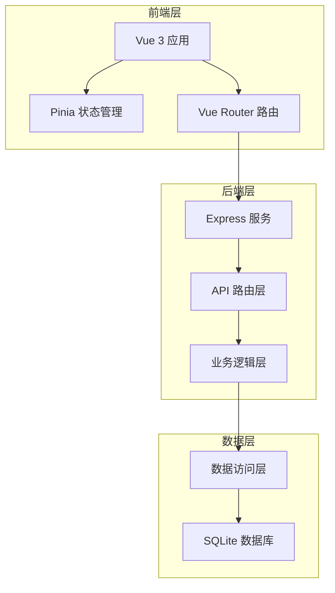
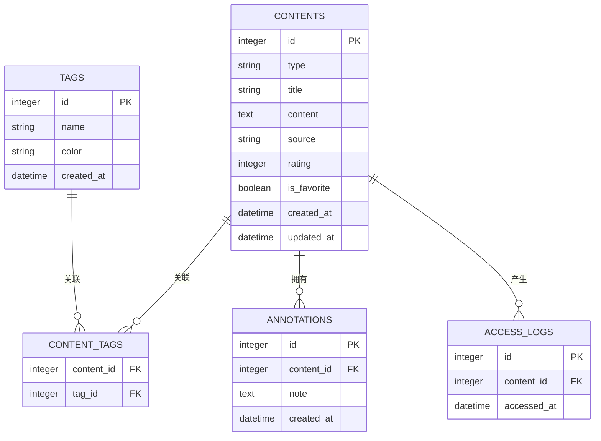
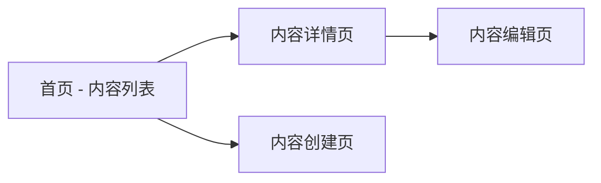
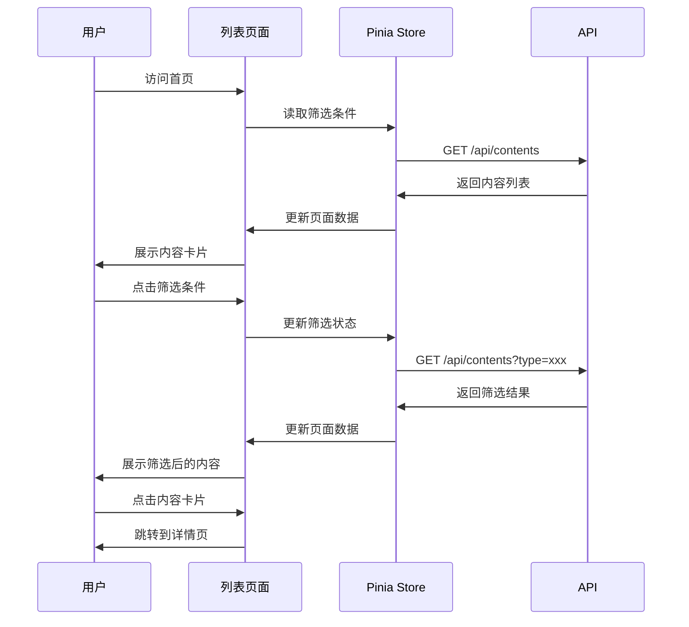
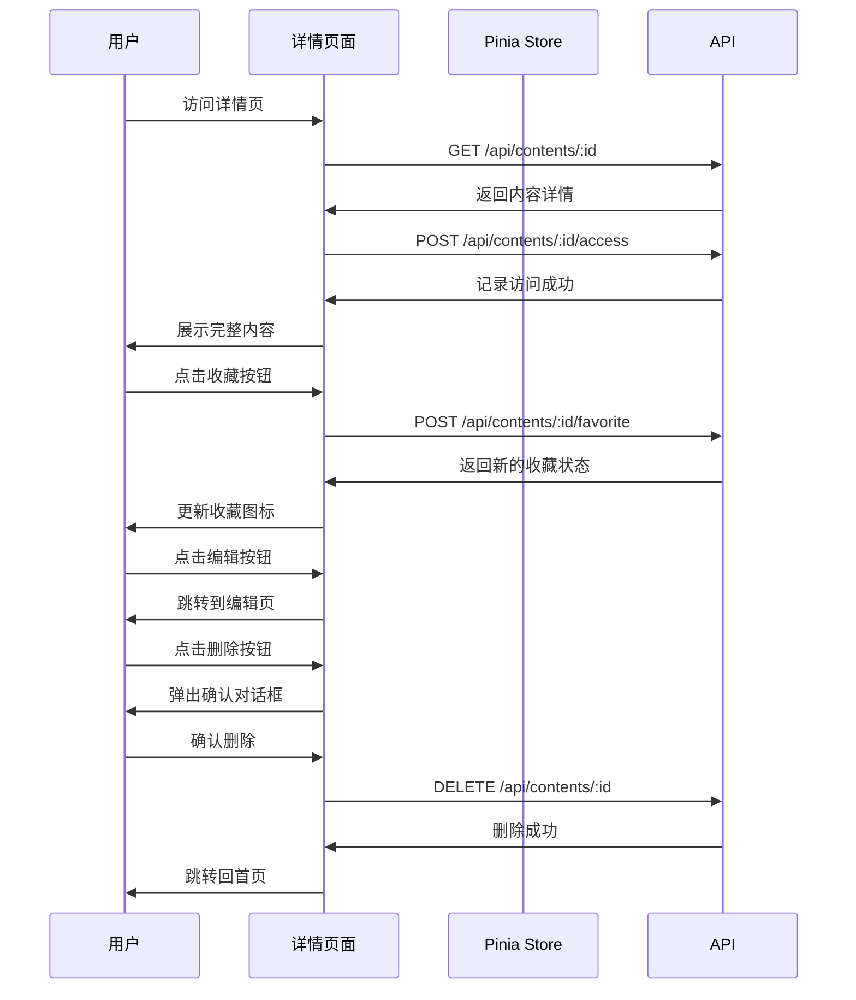
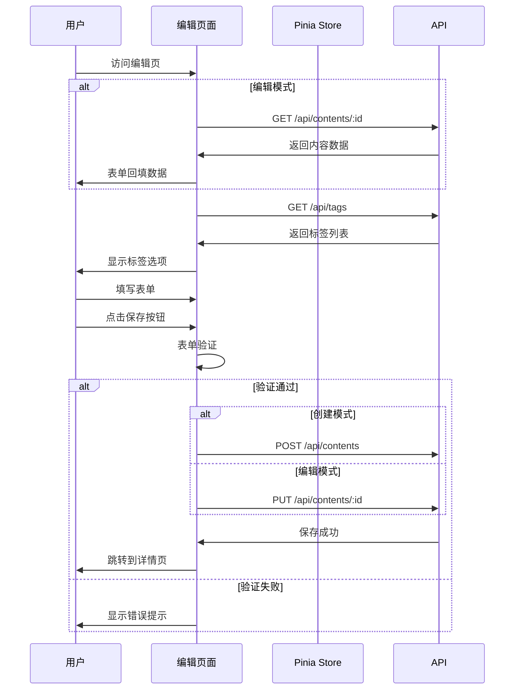

# 外挂大脑系统 MVP 构建设计

## 项目概述

### 项目定位
外挂大脑系统是一个个人知识管理工具，用于积累和组织日常见闻、随笔、文章、音视频和书籍等多类型内容，帮助用户构建第二大脑。

### 核心价值
- 统一管理多类型知识内容
- 通过标签和评分系统快速检索和评价内容
- 记录访问轨迹，形成个人知识图谱
- 本地化存储，保障数据隐私和离线可用性

## 系统架构

### 技术栈选型

| 层级 | 技术选型 | 选型理由 |
|------|---------|---------|
| 前端框架 | Vue 3 + Vite | 现代化、轻量级、开发体验好 |
| 状态管理 | Pinia | Vue 3 官方推荐，API 简洁 |
| 路由管理 | Vue Router | Vue 生态标准路由方案 |
| 后端服务 | Node.js + Express | 轻量级、易于快速开发 |
| 数据库 | SQLite3 | 本地化、零配置、轻量级 |
| 样式方案 | 原生 CSS | 减少依赖，保持简洁 |

### 架构层次

## 数据模型设计

### 核心实体关系

### 数据表详细设计

#### contents 表（内容主表）

| 字段名 | 数据类型 | 约束 | 说明 |
|--------|---------|------|------|
| id | INTEGER | PRIMARY KEY AUTOINCREMENT | 内容唯一标识 |
| type | TEXT | NOT NULL | 内容类型：note/article/media/book |
| title | TEXT | NOT NULL | 内容标题 |
| content | TEXT | | 内容正文 |
| source | TEXT | | 内容来源（URL、书名等） |
| rating | INTEGER | CHECK(rating >= 1 AND rating <= 5) | 评分（1-5星） |
| is_favorite | INTEGER | DEFAULT 0 | 是否收藏（0/1） |
| created_at | DATETIME | DEFAULT CURRENT_TIMESTAMP | 创建时间 |
| updated_at | DATETIME | DEFAULT CURRENT_TIMESTAMP | 更新时间 |

**业务规则**：
- type 字段限定为四种类型：note（随笔）、article（文章）、media（音视频）、book（书籍）
- rating 为可选字段，用于内容质量评估
- is_favorite 用于快速筛选重要内容

#### tags 表（标签表）

| 字段名 | 数据类型 | 约束 | 说明 |
|--------|---------|------|------|
| id | INTEGER | PRIMARY KEY AUTOINCREMENT | 标签唯一标识 |
| name | TEXT | UNIQUE NOT NULL | 标签名称 |
| color | TEXT | | 标签颜色（十六进制） |
| created_at | DATETIME | DEFAULT CURRENT_TIMESTAMP | 创建时间 |

**业务规则**：
- 标签名称唯一，避免重复创建
- color 用于前端展示标签时的视觉区分

#### content_tags 表（内容-标签关联表）

| 字段名 | 数据类型 | 约束 | 说明 |
|--------|---------|------|------|
| content_id | INTEGER | FOREIGN KEY | 关联内容ID |
| tag_id | INTEGER | FOREIGN KEY | 关联标签ID |

**业务规则**：
- 多对多关联，一个内容可以有多个标签，一个标签可以关联多个内容
- 联合主键为 (content_id, tag_id)

#### annotations 表（批注表）

| 字段名 | 数据类型 | 约束 | 说明 |
|--------|---------|------|------|
| id | INTEGER | PRIMARY KEY AUTOINCREMENT | 批注唯一标识 |
| content_id | INTEGER | FOREIGN KEY NOT NULL | 关联内容ID |
| note | TEXT | NOT NULL | 批注内容 |
| created_at | DATETIME | DEFAULT CURRENT_TIMESTAMP | 创建时间 |

**业务规则**：
- 用于记录对内容的思考、评论和笔记
- 一个内容可以有多条批注

#### access_logs 表（访问记录表）

| 字段名 | 数据类型 | 约束 | 说明 |
|--------|---------|------|------|
| id | INTEGER | PRIMARY KEY AUTOINCREMENT | 日志唯一标识 |
| content_id | INTEGER | FOREIGN KEY NOT NULL | 关联内容ID |
| accessed_at | DATETIME | DEFAULT CURRENT_TIMESTAMP | 访问时间 |

**业务规则**：
- 记录每次内容访问时间
- 用于统计热门内容和访问频率

## API 接口设计

### 接口概览

| 分类 | 接口 | 方法 | 描述 |
|------|------|------|------|
| 内容管理 | /api/contents | GET | 获取内容列表 |
| 内容管理 | /api/contents/:id | GET | 获取内容详情 |
| 内容管理 | /api/contents | POST | 创建内容 |
| 内容管理 | /api/contents/:id | PUT | 更新内容 |
| 内容管理 | /api/contents/:id | DELETE | 删除内容 |
| 内容操作 | /api/contents/:id/favorite | POST | 切换收藏状态 |
| 内容操作 | /api/contents/:id/access | POST | 记录访问日志 |
| 标签管理 | /api/tags | GET | 获取标签列表 |
| 标签管理 | /api/tags | POST | 创建标签 |
| 统计信息 | /api/stats | GET | 获取统计数据 |

### 接口详细规格

#### 获取内容列表

**请求**：
- 方法：GET
- 路径：/api/contents
- 查询参数：

| 参数名 | 类型 | 必填 | 说明 |
|--------|------|------|------|
| type | string | 否 | 筛选内容类型 |
| tag | string | 否 | 筛选标签名称 |
| is_favorite | boolean | 否 | 筛选收藏状态 |
| search | string | 否 | 全文搜索关键词 |
| sort | string | 否 | 排序字段（created_at/updated_at/rating） |
| order | string | 否 | 排序方向（asc/desc） |
| page | integer | 否 | 页码（默认1） |
| limit | integer | 否 | 每页数量（默认20） |

**响应**：
- 状态码：200
- 响应体结构：

| 字段 | 类型 | 说明 |
|------|------|------|
| data | array | 内容列表 |
| data[].id | integer | 内容ID |
| data[].type | string | 内容类型 |
| data[].title | string | 标题 |
| data[].content | string | 正文（可能截断） |
| data[].source | string | 来源 |
| data[].rating | integer | 评分 |
| data[].is_favorite | boolean | 是否收藏 |
| data[].tags | array | 标签列表 |
| data[].created_at | string | 创建时间 |
| data[].updated_at | string | 更新时间 |
| total | integer | 总记录数 |
| page | integer | 当前页码 |
| limit | integer | 每页数量 |

#### 获取内容详情

**请求**：
- 方法：GET
- 路径：/api/contents/:id
- 路径参数：id（内容ID）

**响应**：
- 状态码：200（成功）、404（不存在）
- 响应体结构：

| 字段 | 类型 | 说明 |
|------|------|------|
| id | integer | 内容ID |
| type | string | 内容类型 |
| title | string | 标题 |
| content | string | 完整正文 |
| source | string | 来源 |
| rating | integer | 评分 |
| is_favorite | boolean | 是否收藏 |
| tags | array | 标签列表 |
| annotations | array | 批注列表 |
| access_count | integer | 访问次数 |
| created_at | string | 创建时间 |
| updated_at | string | 更新时间 |

#### 创建内容

**请求**：
- 方法：POST
- 路径：/api/contents
- 请求体结构：

| 字段 | 类型 | 必填 | 说明 |
|------|------|------|------|
| type | string | 是 | 内容类型 |
| title | string | 是 | 标题 |
| content | string | 否 | 正文 |
| source | string | 否 | 来源 |
| rating | integer | 否 | 评分（1-5） |
| tags | array | 否 | 标签ID数组 |

**响应**：
- 状态码：201（成功）、400（参数错误）
- 响应体结构：

| 字段 | 类型 | 说明 |
|------|------|------|
| id | integer | 新创建的内容ID |
| message | string | 成功消息 |

#### 更新内容

**请求**：
- 方法：PUT
- 路径：/api/contents/:id
- 路径参数：id（内容ID）
- 请求体结构：同创建接口（所有字段可选）

**响应**：
- 状态码：200（成功）、404（不存在）、400（参数错误）
- 响应体结构：

| 字段 | 类型 | 说明 |
|------|------|------|
| message | string | 成功消息 |

#### 删除内容

**请求**：
- 方法：DELETE
- 路径：/api/contents/:id
- 路径参数：id（内容ID）

**响应**：
- 状态码：200（成功）、404（不存在）
- 响应体结构：

| 字段 | 类型 | 说明 |
|------|------|------|
| message | string | 成功消息 |

**业务规则**：
- 删除内容时，级联删除关联的标签关系、批注和访问日志

#### 切换收藏状态

**请求**：
- 方法：POST
- 路径：/api/contents/:id/favorite
- 路径参数：id（内容ID）

**响应**：
- 状态码：200（成功）、404（不存在）
- 响应体结构：

| 字段 | 类型 | 说明 |
|------|------|------|
| is_favorite | boolean | 新的收藏状态 |
| message | string | 成功消息 |

**业务规则**：
- 切换逻辑：如果当前是收藏状态则取消收藏，否则设为收藏

#### 记录访问日志

**请求**：
- 方法：POST
- 路径：/api/contents/:id/access
- 路径参数：id（内容ID）

**响应**：
- 状态码：200（成功）、404（不存在）
- 响应体结构：

| 字段 | 类型 | 说明 |
|------|------|------|
| message | string | 成功消息 |

**业务规则**：
- 每次访问内容详情页时调用此接口
- 记录当前时间戳到 access_logs 表

#### 获取标签列表

**请求**：
- 方法：GET
- 路径：/api/tags

**响应**：
- 状态码：200
- 响应体结构：

| 字段 | 类型 | 说明 |
|------|------|------|
| data | array | 标签列表 |
| data[].id | integer | 标签ID |
| data[].name | string | 标签名称 |
| data[].color | string | 标签颜色 |
| data[].count | integer | 关联的内容数量 |
| data[].created_at | string | 创建时间 |

#### 创建标签

**请求**：
- 方法：POST
- 路径：/api/tags
- 请求体结构：

| 字段 | 类型 | 必填 | 说明 |
|------|------|------|------|
| name | string | 是 | 标签名称 |
| color | string | 否 | 标签颜色 |

**响应**：
- 状态码：201（成功）、400（参数错误）、409（名称冲突）
- 响应体结构：

| 字段 | 类型 | 说明 |
|------|------|------|
| id | integer | 新创建的标签ID |
| message | string | 成功消息 |

#### 获取统计信息

**请求**：
- 方法：GET
- 路径：/api/stats

**响应**：
- 状态码：200
- 响应体结构：

| 字段 | 类型 | 说明 |
|------|------|------|
| total_contents | integer | 内容总数 |
| contents_by_type | object | 各类型内容数量 |
| total_tags | integer | 标签总数 |
| favorite_count | integer | 收藏内容数量 |
| recent_accessed | array | 最近访问的内容（前10条） |
| most_accessed | array | 访问最多的内容（前10条） |

## 前端页面设计

### 页面结构

### 页面详细设计

#### 首页（内容列表页）

**路由路径**：/

**页面职责**：
- 展示所有内容的卡片式列表
- 提供筛选和搜索功能
- 提供快速收藏和跳转详情的操作

**页面布局**：

| 区域 | 功能说明 |
|------|---------|
| 顶部导航栏 | 包含系统标题、搜索框、新建按钮 |
| 左侧筛选栏 | 提供类型筛选、标签筛选、收藏筛选 |
| 主内容区 | 卡片式展示内容列表 |
| 底部分页器 | 分页导航 |

**交互流程**：

**内容卡片设计**：
- 显示标题、内容摘要（前100字）、标签、评分、收藏状态
- 提供快速收藏按钮
- 点击卡片进入详情页

#### 内容详情页

**路由路径**：/content/:id

**页面职责**：
- 展示完整的内容信息
- 显示批注列表
- 记录访问日志

**页面布局**：

| 区域 | 功能说明 |
|------|---------|
| 顶部导航栏 | 返回按钮、编辑按钮、删除按钮 |
| 内容信息区 | 标题、正文、来源、标签、评分、收藏状态 |
| 批注区 | 显示所有批注，提供添加批注功能 |
| 元数据区 | 创建时间、更新时间、访问次数 |

**交互流程**：

#### 内容创建/编辑页

**路由路径**：
- 创建：/content/new
- 编辑：/content/:id/edit

**页面职责**：
- 提供表单输入内容信息
- 支持标签选择和创建
- 提交保存或更新

**页面布局**：

| 区域 | 功能说明 |
|------|---------|
| 顶部导航栏 | 返回按钮、保存按钮 |
| 表单区 | 类型选择、标题输入、正文编辑、来源输入、评分选择、标签选择 |

**表单字段设计**：

| 字段 | 输入类型 | 验证规则 |
|------|---------|---------|
| 类型 | 下拉选择 | 必填，限定为 note/article/media/book |
| 标题 | 文本输入 | 必填，最大长度200字符 |
| 正文 | 多行文本 | 可选，支持富文本或Markdown |
| 来源 | 文本输入 | 可选，最大长度500字符 |
| 评分 | 星级选择器 | 可选，1-5星 |
| 标签 | 多选下拉 | 可选，支持选择已有标签或创建新标签 |

**交互流程**：

## 核心功能实现策略

### 全文搜索实现

**搜索范围**：
- 内容标题
- 内容正文
- 标签名称

**实现方式**：
- 使用 SQLite 的 LIKE 语句进行模糊匹配
- 搜索关键词在标题中权重更高
- 支持多关键词搜索（空格分隔）

**查询逻辑**：
- 在 contents 表的 title 和 content 字段中搜索
- 通过 content_tags 和 tags 表关联搜索标签
- 按相关度排序：标题匹配 > 内容匹配 > 标签匹配

### 标签系统实现

**标签管理策略**：
- 标签全局唯一，避免重复创建
- 标签颜色可自定义，用于视觉区分
- 删除标签时，解除关联但不删除内容

**标签使用流程**：
- 创建内容时选择标签：优先从已有标签中选择，如不存在则创建新标签
- 编辑内容时修改标签：可添加或移除标签关联
- 筛选页面按标签查询：支持单标签筛选和多标签组合

**标签统计**：
- 统计每个标签关联的内容数量
- 显示热门标签（关联内容最多的标签）

### 评分系统实现

**评分机制**：
- 1-5星评分，用于标记内容质量或重要性
- 评分为可选字段，允许不评分
- 支持后续修改评分

**评分展示**：
- 列表页和详情页显示星级图标
- 支持按评分排序和筛选

### 收藏功能实现

**收藏机制**：
- 布尔字段标记收藏状态
- 支持一键切换收藏/取消收藏
- 收藏状态变更即时生效

**收藏应用场景**：
- 快速标记重要内容
- 首页提供"只看收藏"筛选
- 统计页显示收藏数量

### 访问统计实现

**统计方式**：
- 每次访问详情页时记录时间戳
- 通过 access_logs 表累积访问记录
- 统计访问次数和最后访问时间

**统计应用**：
- 显示最近访问的内容（按时间倒序）
- 显示热门内容（按访问次数降序）
- 个人知识回顾：查看访问历史

## 项目结构规划

### 目录结构

| 目录路径 | 用途说明 |
|---------|---------|
| /data | 数据存储目录，存放 SQLite 数据库文件 |
| /server | 后端服务代码 |
| /server/index.js | Express 服务入口 |
| /server/routes | API 路由定义 |
| /server/controllers | 业务逻辑处理 |
| /server/models | 数据访问层 |
| /src | 前端源码 |
| /src/views | 页面组件 |
| /src/stores | Pinia 状态管理 |
| /src/router | Vue Router 路由配置 |
| /src/utils | 工具函数（API请求、日期格式化等） |
| /src/components | 可复用组件 |
| /src/assets | 静态资源（样式、图片） |
| /public | 公共资源 |

### 启动脚本设计

#### Windows 启动脚本（start.bat）

**功能**：
- 检查 Node.js 环境
- 并行启动后端服务和前端开发服务器
- 自动打开浏览器

**执行流程**：
- 检测 npm 命令是否可用
- 在新窗口中运行 `npm run server`
- 在新窗口中运行 `npm run dev`
- 等待服务启动后打开浏览器访问前端地址

#### Linux/Mac 启动脚本（start.sh）

**功能**：同 Windows 版本

**执行流程**：
- 赋予执行权限
- 检测 npm 命令是否可用
- 后台运行后端服务
- 前台运行前端开发服务器

## 部署与运行

### 环境要求

| 组件 | 版本要求 |
|------|---------|
| Node.js | >= 16.x |
| npm | >= 8.x |

### 初始化步骤

**步骤一：安装依赖**
- 在项目根目录执行依赖安装命令
- 安装前端依赖（Vue、Vite、Pinia、Vue Router等）
- 安装后端依赖（Express、SQLite3、CORS等）

**步骤二：数据库初始化**
- 创建 data 目录
- 运行数据库初始化脚本
- 创建所有必需的数据表

**步骤三：配置端口**
- 后端默认端口：3000
- 前端默认端口：5173
- 可通过配置文件修改

### 启动方式

**方式一：使用启动脚本**
- Windows 系统：双击 start.bat
- Linux/Mac 系统：执行 ./start.sh

**方式二：手动启动**
- 终端一：启动后端服务
- 终端二：启动前端开发服务器
- 浏览器访问前端地址

### 数据备份策略

**备份对象**：
- data/brain.db 数据库文件

**备份方式**：
- 手动备份：复制数据库文件到安全位置
- 定期备份：建议每周备份一次
- 版本管理：数据库文件不纳入 Git 版本控制

## 质量保障

### 数据完整性保障

**数据库约束**：
- 主键约束：确保每条记录唯一
- 外键约束：保证关联数据的引用完整性
- 非空约束：必填字段不允许为空
- 唯一约束：标签名称全局唯一
- 检查约束：评分范围限制在1-5

**级联操作**：
- 删除内容时，级联删除关联的标签关系、批注、访问日志
- 删除标签时，仅删除关联关系，不影响内容

### 用户体验优化

**响应速度**：
- 列表页分页加载，每页20条
- 搜索结果实时返回
- 收藏操作即时反馈

**操作反馈**：
- 成功操作显示提示消息
- 错误操作显示明确的错误信息
- 加载过程显示加载状态

**容错处理**：
- 表单验证前端后端双重校验
- API 错误统一处理和提示
- 删除操作二次确认

### 扩展性考虑

**功能扩展预留**：
- 数据模型支持后续添加字段
- API 接口版本化预留
- 前端组件化便于功能迭代

**技术扩展方向**：
- 支持富文本或 Markdown 编辑器
- 导出导入功能（JSON、Markdown）
- 云端同步功能
- 移动端适配
- 多用户支持

## 风险评估

### 技术风险

| 风险项 | 风险等级 | 应对措施 |
|--------|---------|---------|
| SQLite 性能瓶颈 | 低 | 初期数据量小，后期可迁移到 PostgreSQL |
| 前端状态管理复杂度 | 低 | Pinia 简洁易用，状态层级简单 |
| 全文搜索性能 | 中 | 初期使用 LIKE，后期可引入全文索引 |

### 数据风险

| 风险项 | 风险等级 | 应对措施 |
|--------|---------|---------|
| 数据丢失 | 中 | 提示用户定期备份，提供导出功能 |
| 数据迁移 | 低 | 数据库结构简单，迁移成本低 |

### 用户体验风险

| 风险项 | 风险等级 | 应对措施 |
|--------|---------|---------|
| 学习成本 | 低 | 界面简洁直观，功能清晰 |
| 数据组织混乱 | 中 | 提供标签和评分辅助组织 |

## 实施路径

### 第一阶段：基础架构搭建

**任务列表**：
- 初始化 Vue 3 + Vite 前端项目
- 初始化 Express 后端项目
- 配置 Pinia 状态管理
- 配置 Vue Router 路由
- 创建 SQLite 数据库和表结构

**交付物**：
- 可运行的前后端框架
- 数据库初始化脚本

### 第二阶段：核心功能开发

**任务列表**：
- 实现内容管理 API（增删改查）
- 实现标签管理 API
- 实现统计 API
- 开发首页内容列表页面
- 开发内容详情页面
- 开发内容编辑/创建页面

**交付物**：
- 完整的 API 接口
- 三个核心页面

### 第三阶段：功能完善

**任务列表**：
- 实现全文搜索功能
- 实现筛选和排序功能
- 实现收藏和评分功能
- 实现访问统计功能
- 优化页面样式和交互

**交付物**：
- 所有功能可用的 MVP 版本

### 第四阶段：测试与优化

**任务列表**：
- 功能测试
- 性能测试
- 用户体验优化
- 编写启动脚本
- 编写使用文档

**交付物**：
- 稳定可用的 MVP 系统
- 完整的文档
| 元数据区 | 创建时间、更新时间、访问次数 |

**交互流程**：

#### 内容创建/编辑页

**路由路径**：
- 创建：/content/new
- 编辑：/content/:id/edit

**页面职责**：
- 提供表单输入内容信息
- 支持标签选择和创建
- 提交保存或更新

**页面布局**：

| 区域 | 功能说明 |
|------|---------|
| 顶部导航栏 | 返回按钮、保存按钮 |
| 表单区 | 类型选择、标题输入、正文编辑、来源输入、评分选择、标签选择 |

**表单字段设计**：

| 字段 | 输入类型 | 验证规则 |
|------|---------|---------|
| 类型 | 下拉选择 | 必填，限定为 note/article/media/book |
| 标题 | 文本输入 | 必填，最大长度200字符 |
| 正文 | 多行文本 | 可选，支持富文本或Markdown |
| 来源 | 文本输入 | 可选，最大长度500字符 |
| 评分 | 星级选择器 | 可选，1-5星 |
| 标签 | 多选下拉 | 可选，支持选择已有标签或创建新标签 |

**交互流程**：

## 核心功能实现策略

### 全文搜索实现

**搜索范围**：
- 内容标题
- 内容正文
- 标签名称

**实现方式**：
- 使用 SQLite 的 LIKE 语句进行模糊匹配
- 搜索关键词在标题中权重更高
- 支持多关键词搜索（空格分隔）

**查询逻辑**：
- 在 contents 表的 title 和 content 字段中搜索
- 通过 content_tags 和 tags 表关联搜索标签
- 按相关度排序：标题匹配 > 内容匹配 > 标签匹配

### 标签系统实现

**标签管理策略**：
- 标签全局唯一，避免重复创建
- 标签颜色可自定义，用于视觉区分
- 删除标签时，解除关联但不删除内容

**标签使用流程**：
- 创建内容时选择标签：优先从已有标签中选择，如不存在则创建新标签
- 编辑内容时修改标签：可添加或移除标签关联
- 筛选页面按标签查询：支持单标签筛选和多标签组合

**标签统计**：
- 统计每个标签关联的内容数量
- 显示热门标签（关联内容最多的标签）

### 评分系统实现

**评分机制**：
- 1-5星评分，用于标记内容质量或重要性
- 评分为可选字段，允许不评分
- 支持后续修改评分

**评分展示**：
- 列表页和详情页显示星级图标
- 支持按评分排序和筛选

### 收藏功能实现

**收藏机制**：
- 布尔字段标记收藏状态
- 支持一键切换收藏/取消收藏
- 收藏状态变更即时生效

**收藏应用场景**：
- 快速标记重要内容
- 首页提供"只看收藏"筛选
- 统计页显示收藏数量

### 访问统计实现

**统计方式**：
- 每次访问详情页时记录时间戳
- 通过 access_logs 表累积访问记录
- 统计访问次数和最后访问时间

**统计应用**：
- 显示最近访问的内容（按时间倒序）
- 显示热门内容（按访问次数降序）
- 个人知识回顾：查看访问历史

## 项目结构规划

### 目录结构

| 目录路径 | 用途说明 |
|---------|---------|
| /data | 数据存储目录，存放 SQLite 数据库文件 |
| /server | 后端服务代码 |
| /server/index.js | Express 服务入口 |
| /server/routes | API 路由定义 |
| /server/controllers | 业务逻辑处理 |
| /server/models | 数据访问层 |
| /src | 前端源码 |
| /src/views | 页面组件 |
| /src/stores | Pinia 状态管理 |
| /src/router | Vue Router 路由配置 |
| /src/utils | 工具函数（API请求、日期格式化等） |
| /src/components | 可复用组件 |
| /src/assets | 静态资源（样式、图片） |
| /public | 公共资源 |

### 启动脚本设计

#### Windows 启动脚本（start.bat）

**功能**：
- 检查 Node.js 环境
- 并行启动后端服务和前端开发服务器
- 自动打开浏览器

**执行流程**：
- 检测 npm 命令是否可用
- 在新窗口中运行 `npm run server`
- 在新窗口中运行 `npm run dev`
- 等待服务启动后打开浏览器访问前端地址

#### Linux/Mac 启动脚本（start.sh）

**功能**：同 Windows 版本

**执行流程**：
- 赋予执行权限
- 检测 npm 命令是否可用
- 后台运行后端服务
- 前台运行前端开发服务器

## 部署与运行

### 环境要求

| 组件 | 版本要求 |
|------|---------|
| Node.js | >= 16.x |
| npm | >= 8.x |

### 初始化步骤

**步骤一：安装依赖**
- 在项目根目录执行依赖安装命令
- 安装前端依赖（Vue、Vite、Pinia、Vue Router等）
- 安装后端依赖（Express、SQLite3、CORS等）

**步骤二：数据库初始化**
- 创建 data 目录
- 运行数据库初始化脚本
- 创建所有必需的数据表

**步骤三：配置端口**
- 后端默认端口：3000
- 前端默认端口：5173
- 可通过配置文件修改

### 启动方式

**方式一：使用启动脚本**
- Windows 系统：双击 start.bat
- Linux/Mac 系统：执行 ./start.sh

**方式二：手动启动**
- 终端一：启动后端服务
- 终端二：启动前端开发服务器
- 浏览器访问前端地址

### 数据备份策略

**备份对象**：
- data/brain.db 数据库文件

**备份方式**：
- 手动备份：复制数据库文件到安全位置
- 定期备份：建议每周备份一次
- 版本管理：数据库文件不纳入 Git 版本控制

## 质量保障

### 数据完整性保障

**数据库约束**：
- 主键约束：确保每条记录唯一
- 外键约束：保证关联数据的引用完整性
- 非空约束：必填字段不允许为空
- 唯一约束：标签名称全局唯一
- 检查约束：评分范围限制在1-5

**级联操作**：
- 删除内容时，级联删除关联的标签关系、批注、访问日志
- 删除标签时，仅删除关联关系，不影响内容

### 用户体验优化

**响应速度**：
- 列表页分页加载，每页20条
- 搜索结果实时返回
- 收藏操作即时反馈

**操作反馈**：
- 成功操作显示提示消息
- 错误操作显示明确的错误信息
- 加载过程显示加载状态

**容错处理**：
- 表单验证前端后端双重校验
- API 错误统一处理和提示
- 删除操作二次确认

### 扩展性考虑

**功能扩展预留**：
- 数据模型支持后续添加字段
- API 接口版本化预留
- 前端组件化便于功能迭代

**技术扩展方向**：
- 支持富文本或 Markdown 编辑器
- 导出导入功能（JSON、Markdown）
- 云端同步功能
- 移动端适配
- 多用户支持

## 风险评估

### 技术风险

| 风险项 | 风险等级 | 应对措施 |
|--------|---------|---------|
| SQLite 性能瓶颈 | 低 | 初期数据量小，后期可迁移到 PostgreSQL |
| 前端状态管理复杂度 | 低 | Pinia 简洁易用，状态层级简单 |
| 全文搜索性能 | 中 | 初期使用 LIKE，后期可引入全文索引 |

### 数据风险

| 风险项 | 风险等级 | 应对措施 |
|--------|---------|---------|
| 数据丢失 | 中 | 提示用户定期备份，提供导出功能 |
| 数据迁移 | 低 | 数据库结构简单，迁移成本低 |

### 用户体验风险

| 风险项 | 风险等级 | 应对措施 |
|--------|---------|---------|
| 学习成本 | 低 | 界面简洁直观，功能清晰 |
| 数据组织混乱 | 中 | 提供标签和评分辅助组织 |

## 实施路径

### 第一阶段：基础架构搭建

**任务列表**：
- 初始化 Vue 3 + Vite 前端项目
- 初始化 Express 后端项目
- 配置 Pinia 状态管理
- 配置 Vue Router 路由
- 创建 SQLite 数据库和表结构

**交付物**：
- 可运行的前后端框架
- 数据库初始化脚本

### 第二阶段：核心功能开发

**任务列表**：
- 实现内容管理 API（增删改查）
- 实现标签管理 API
- 实现统计 API
- 开发首页内容列表页面
- 开发内容详情页面
- 开发内容编辑/创建页面

**交付物**：
- 完整的 API 接口
- 三个核心页面

### 第三阶段：功能完善

**任务列表**：
- 实现全文搜索功能
- 实现筛选和排序功能
- 实现收藏和评分功能
- 实现访问统计功能
- 优化页面样式和交互

**交付物**：
- 所有功能可用的 MVP 版本

### 第四阶段：测试与优化

**任务列表**：
- 功能测试
- 性能测试
- 用户体验优化
- 编写启动脚本
- 编写使用文档

**交付物**：
- 稳定可用的 MVP 系统
- 完整的文档
| 内容信息区 | 标题、正文、来源、标签、评分、收藏状态 |
| 批注区 | 显示所有批注，提供添加批注功能 |
| 元数据区 | 创建时间、更新时间、访问次数 |

**交互流程**：

#### 内容创建/编辑页

**路由路径**：
- 创建：/content/new
- 编辑：/content/:id/edit

**页面职责**：
- 提供表单输入内容信息
- 支持标签选择和创建
- 提交保存或更新

**页面布局**：

| 区域 | 功能说明 |
|------|---------|
| 顶部导航栏 | 返回按钮、保存按钮 |
| 表单区 | 类型选择、标题输入、正文编辑、来源输入、评分选择、标签选择 |

**表单字段设计**：

| 字段 | 输入类型 | 验证规则 |
|------|---------|---------|
| 类型 | 下拉选择 | 必填，限定为 note/article/media/book |
| 标题 | 文本输入 | 必填，最大长度200字符 |
| 正文 | 多行文本 | 可选，支持富文本或Markdown |
| 来源 | 文本输入 | 可选，最大长度500字符 |
| 评分 | 星级选择器 | 可选，1-5星 |
| 标签 | 多选下拉 | 可选，支持选择已有标签或创建新标签 |

**交互流程**：

## 核心功能实现策略

### 全文搜索实现

**搜索范围**：
- 内容标题
- 内容正文
- 标签名称

**实现方式**：
- 使用 SQLite 的 LIKE 语句进行模糊匹配
- 搜索关键词在标题中权重更高
- 支持多关键词搜索（空格分隔）

**查询逻辑**：
- 在 contents 表的 title 和 content 字段中搜索
- 通过 content_tags 和 tags 表关联搜索标签
- 按相关度排序：标题匹配 > 内容匹配 > 标签匹配

### 标签系统实现

**标签管理策略**：
- 标签全局唯一，避免重复创建
- 标签颜色可自定义，用于视觉区分
- 删除标签时，解除关联但不删除内容

**标签使用流程**：
- 创建内容时选择标签：优先从已有标签中选择，如不存在则创建新标签
- 编辑内容时修改标签：可添加或移除标签关联
- 筛选页面按标签查询：支持单标签筛选和多标签组合

**标签统计**：
- 统计每个标签关联的内容数量
- 显示热门标签（关联内容最多的标签）

### 评分系统实现

**评分机制**：
- 1-5星评分，用于标记内容质量或重要性
- 评分为可选字段，允许不评分
- 支持后续修改评分

**评分展示**：
- 列表页和详情页显示星级图标
- 支持按评分排序和筛选

### 收藏功能实现

**收藏机制**：
- 布尔字段标记收藏状态
- 支持一键切换收藏/取消收藏
- 收藏状态变更即时生效

**收藏应用场景**：
- 快速标记重要内容
- 首页提供"只看收藏"筛选
- 统计页显示收藏数量

### 访问统计实现

**统计方式**：
- 每次访问详情页时记录时间戳
- 通过 access_logs 表累积访问记录
- 统计访问次数和最后访问时间

**统计应用**：
- 显示最近访问的内容（按时间倒序）
- 显示热门内容（按访问次数降序）
- 个人知识回顾：查看访问历史

## 项目结构规划

### 目录结构

| 目录路径 | 用途说明 |
|---------|---------|
| /data | 数据存储目录，存放 SQLite 数据库文件 |
| /server | 后端服务代码 |
| /server/index.js | Express 服务入口 |
| /server/routes | API 路由定义 |
| /server/controllers | 业务逻辑处理 |
| /server/models | 数据访问层 |
| /src | 前端源码 |
| /src/views | 页面组件 |
| /src/stores | Pinia 状态管理 |
| /src/router | Vue Router 路由配置 |
| /src/utils | 工具函数（API请求、日期格式化等） |
| /src/components | 可复用组件 |
| /src/assets | 静态资源（样式、图片） |
| /public | 公共资源 |

### 启动脚本设计

#### Windows 启动脚本（start.bat）

**功能**：
- 检查 Node.js 环境
- 并行启动后端服务和前端开发服务器
- 自动打开浏览器

**执行流程**：
- 检测 npm 命令是否可用
- 在新窗口中运行 `npm run server`
- 在新窗口中运行 `npm run dev`
- 等待服务启动后打开浏览器访问前端地址

#### Linux/Mac 启动脚本（start.sh）

**功能**：同 Windows 版本

**执行流程**：
- 赋予执行权限
- 检测 npm 命令是否可用
- 后台运行后端服务
- 前台运行前端开发服务器

## 部署与运行

### 环境要求

| 组件 | 版本要求 |
|------|---------|
| Node.js | >= 16.x |
| npm | >= 8.x |

### 初始化步骤

**步骤一：安装依赖**
- 在项目根目录执行依赖安装命令
- 安装前端依赖（Vue、Vite、Pinia、Vue Router等）
- 安装后端依赖（Express、SQLite3、CORS等）

**步骤二：数据库初始化**
- 创建 data 目录
- 运行数据库初始化脚本
- 创建所有必需的数据表

**步骤三：配置端口**
- 后端默认端口：3000
- 前端默认端口：5173
- 可通过配置文件修改

### 启动方式

**方式一：使用启动脚本**
- Windows 系统：双击 start.bat
- Linux/Mac 系统：执行 ./start.sh

**方式二：手动启动**
- 终端一：启动后端服务
- 终端二：启动前端开发服务器
- 浏览器访问前端地址

### 数据备份策略

**备份对象**：
- data/brain.db 数据库文件

**备份方式**：
- 手动备份：复制数据库文件到安全位置
- 定期备份：建议每周备份一次
- 版本管理：数据库文件不纳入 Git 版本控制

## 质量保障

### 数据完整性保障

**数据库约束**：
- 主键约束：确保每条记录唯一
- 外键约束：保证关联数据的引用完整性
- 非空约束：必填字段不允许为空
- 唯一约束：标签名称全局唯一
- 检查约束：评分范围限制在1-5

**级联操作**：
- 删除内容时，级联删除关联的标签关系、批注、访问日志
- 删除标签时，仅删除关联关系，不影响内容

### 用户体验优化

**响应速度**：
- 列表页分页加载，每页20条
- 搜索结果实时返回
- 收藏操作即时反馈

**操作反馈**：
- 成功操作显示提示消息
- 错误操作显示明确的错误信息
- 加载过程显示加载状态

**容错处理**：
- 表单验证前端后端双重校验
- API 错误统一处理和提示
- 删除操作二次确认

### 扩展性考虑

**功能扩展预留**：
- 数据模型支持后续添加字段
- API 接口版本化预留
- 前端组件化便于功能迭代

**技术扩展方向**：
- 支持富文本或 Markdown 编辑器
- 导出导入功能（JSON、Markdown）
- 云端同步功能
- 移动端适配
- 多用户支持

## 风险评估

### 技术风险

| 风险项 | 风险等级 | 应对措施 |
|--------|---------|---------|
| SQLite 性能瓶颈 | 低 | 初期数据量小，后期可迁移到 PostgreSQL |
| 前端状态管理复杂度 | 低 | Pinia 简洁易用，状态层级简单 |
| 全文搜索性能 | 中 | 初期使用 LIKE，后期可引入全文索引 |

### 数据风险

| 风险项 | 风险等级 | 应对措施 |
|--------|---------|---------|
| 数据丢失 | 中 | 提示用户定期备份，提供导出功能 |
| 数据迁移 | 低 | 数据库结构简单，迁移成本低 |

### 用户体验风险

| 风险项 | 风险等级 | 应对措施 |
|--------|---------|---------|
| 学习成本 | 低 | 界面简洁直观，功能清晰 |
| 数据组织混乱 | 中 | 提供标签和评分辅助组织 |

## 实施路径

### 第一阶段：基础架构搭建

**任务列表**：
- 初始化 Vue 3 + Vite 前端项目
- 初始化 Express 后端项目
- 配置 Pinia 状态管理
- 配置 Vue Router 路由
- 创建 SQLite 数据库和表结构

**交付物**：
- 可运行的前后端框架
- 数据库初始化脚本

### 第二阶段：核心功能开发

**任务列表**：
- 实现内容管理 API（增删改查）
- 实现标签管理 API
- 实现统计 API
- 开发首页内容列表页面
- 开发内容详情页面
- 开发内容编辑/创建页面

**交付物**：
- 完整的 API 接口
- 三个核心页面

### 第三阶段：功能完善

**任务列表**：
- 实现全文搜索功能
- 实现筛选和排序功能
- 实现收藏和评分功能
- 实现访问统计功能
- 优化页面样式和交互

**交付物**：
- 所有功能可用的 MVP 版本

### 第四阶段：测试与优化

**任务列表**：
- 功能测试
- 性能测试
- 用户体验优化
- 编写启动脚本
- 编写使用文档

**交付物**：
- 稳定可用的 MVP 系统
- 完整的文档
