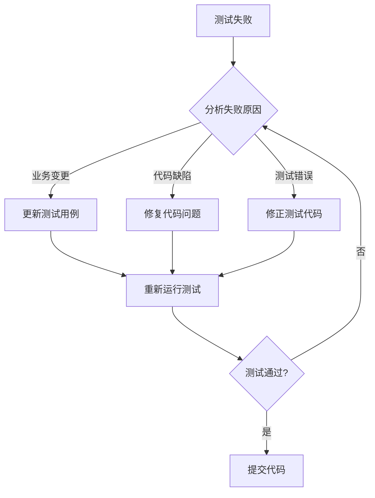

# 日志监控与测试系统设计

## 一、设计目标

为外挂大脑搭建完整的日志监控体系和单元测试基础设施，满足以下核心需求：

- 记录系统运行过程中的关键信息和中间状态，便于问题排查
- 建立分级日志机制，区分调试、信息、警告和错误
- 构建单元测试框架，保障代码质量
- 建立测试更新机制，确保项目演进时测试同步更新

## 二、日志系统设计

### 2.1 日志分层架构

系统采用分层日志记录策略，覆盖应用的各个关键层次：

| 日志层次 | 记录范围 | 日志级别 | 用途 |
|---------|---------|---------|------|
| 应用层 | Express服务启动、关闭、配置加载 | info, error | 应用生命周期追踪 |
| 路由层 | API请求入口、响应状态、耗时 | info, warn, error | 接口调用追踪 |
| 业务层 | 内容创建、标签关联、用户认证等核心操作 | info, error | 业务逻辑追踪 |
| 数据层 | SQL执行、数据库连接、查询性能 | debug, error | 数据操作追踪 |
| 中间件层 | 认证验证、请求预处理 | debug, warn, error | 请求处理流程追踪 |

### 2.2 日志级别定义

采用标准日志级别体系：

- **error**: 错误事件，影响功能正常运行（如数据库连接失败、API调用失败）
- **warn**: 警告信息，潜在问题但不影响运行（如参数校验失败、资源即将耗尽）
- **info**: 重要信息，记录关键业务操作（如用户登录、内容创建成功）
- **debug**: 调试信息，详细的程序执行流程（如SQL语句、参数值）

### 2.3 日志存储策略

日志文件按日期和类型分类存储：

```
logs/
├── app/
│   ├── app-2026-01-08.log          # 应用日志（info及以上）
│   ├── app-error-2026-01-08.log    # 应用错误日志
│   └── app-debug-2026-01-08.log    # 调试日志（仅开发环境）
├── api/
│   ├── api-2026-01-08.log          # API访问日志
│   └── api-error-2026-01-08.log    # API错误日志
└── database/
    ├── db-2026-01-08.log           # 数据库操作日志
    └── db-error-2026-01-08.log     # 数据库错误日志
```

文件管理规则：

- 日志文件按日期自动轮转
- 保留最近30天的日志文件
- 错误日志单独存储，便于快速定位问题
- 调试日志仅在开发环境启用

### 2.4 日志格式规范

统一的日志输出格式，便于解析和分析：

| 字段 | 说明 | 示例 |
|------|------|------|
| timestamp | ISO 8601格式时间戳 | 2026-01-08T10:30:45.123Z |
| level | 日志级别 | error, warn, info, debug |
| category | 日志分类 | app, api, database, auth |
| message | 日志消息 | User login successful |
| context | 上下文信息（对象） | {userId: 123, ip: "127.0.0.1"} |
| requestId | 请求追踪ID（API请求） | req_abc123xyz |
| duration | 操作耗时（毫秒） | 156 |
| stack | 错误堆栈（仅错误日志） | Error: ...\n at ... |

### 2.5 关键记录点

#### 应用层记录点

- 服务启动与关闭：记录端口、环境变量、初始化状态
- 数据库初始化：记录表结构创建、数据迁移结果
- 配置加载：记录关键配置项（脱敏处理）
- 未捕获异常：记录全局错误和进程崩溃信息

#### API层记录点

每个API请求记录以下信息：

- 请求开始：HTTP方法、路径、查询参数、请求体（敏感信息脱敏）
- 请求结束：响应状态码、响应时长、错误信息（如有）
- 认证信息：用户ID、令牌类型（不记录令牌值）
- 业务关键操作：内容创建/更新/删除、标签关联、收藏操作

#### 数据库层记录点

- SQL执行：记录SQL语句、参数、执行时长
- 连接管理：记录数据库连接获取、释放
- 查询性能：记录慢查询（超过阈值）
- 数据库错误：记录约束冲突、语法错误等

#### 业务层记录点

- 内容管理：创建、更新、删除、查询内容的关键步骤
- 标签操作：标签创建、关联、解绑
- 用户认证：登录尝试、令牌验证、权限检查
- 访问统计：访问日志记录、统计数据生成

### 2.6 性能与安全考虑

#### 性能优化

- 异步写入：日志写入不阻塞主线程
- 批量写入：聚合日志批量写入磁盘
- 日志采样：高频操作按比例记录（如访问日志）
- 缓冲区管理：内存缓冲控制在合理范围

#### 安全措施

- 敏感信息脱敏：密码、令牌、身份证号等自动脱敏
- 访问控制：日志文件权限限制
- 数据保护：日志中的个人隐私数据最小化
- 传输加密：日志传输时使用加密通道（如需远程传输）

### 2.7 日志查询与分析

提供便捷的日志查询能力：

- 按时间范围查询
- 按日志级别过滤
- 按分类筛选
- 按关键字搜索
- 按请求ID追踪完整请求链路

## 三、监控系统设计

### 3.1 监控指标

系统运行状态监控指标：

| 指标类别 | 监控项 | 阈值 | 说明 |
|---------|--------|------|------|
| 应用健康 | 服务可用性 | - | 健康检查接口响应 |
| 应用健康 | 进程存活状态 | - | 进程是否正常运行 |
| 错误统计 | 错误数量 | >10次/分钟 | 系统错误频率 |
| 错误统计 | 错误率 | >5% | 请求错误比例 |
| 性能指标 | API响应时长 | >1000ms | P95响应时长 |
| 性能指标 | 数据库查询时长 | >500ms | 慢查询统计 |
| 资源使用 | 数据库连接数 | 接近上限 | SQLite并发连接 |
| 资源使用 | 日志文件大小 | >100MB/天 | 异常日志量 |

### 3.2 监控数据采集

监控数据采集策略：

- 实时采集：通过日志系统实时收集错误和性能数据
- 定期汇总：每小时汇总统计指标
- 趋势分析：对比历史数据识别异常趋势

### 3.3 健康检查机制

扩展现有的健康检查接口，提供详细的系统状态信息：

健康检查响应结构：

| 字段 | 类型 | 说明 |
|------|------|------|
| status | string | 整体状态：healthy, degraded, unhealthy |
| timestamp | string | 检查时间戳 |
| uptime | number | 服务运行时长（秒） |
| version | string | 应用版本号 |
| checks | object | 各组件健康状态 |

各组件健康检查：

- 数据库连接：尝试执行简单查询
- 文件系统：检查日志目录可写性
- 内存使用：检查内存占用是否正常
- 错误率：检查近期错误频率

### 3.4 错误追踪

错误事件详细记录：

- 错误类型：系统错误、业务错误、验证错误
- 错误上下文：请求信息、用户信息、操作参数
- 错误堆栈：完整的调用堆栈
- 首次出现时间：便于识别新问题
- 发生频率：统计相同错误的出现次数

错误分类规则：

| 错误类型 | 识别特征 | 处理优先级 |
|---------|---------|-----------|
| 致命错误 | 导致服务崩溃 | 最高 |
| 数据库错误 | 数据库操作失败 | 高 |
| 业务逻辑错误 | 业务规则违反 | 中 |
| 验证错误 | 参数校验失败 | 低 |
| 认证授权错误 | 权限不足 | 中 |

### 3.5 性能监控

关键性能指标追踪：

- API响应时间分布：P50、P95、P99
- 数据库查询性能：平均时长、最慢查询
- 请求吞吐量：每秒请求数（QPS）
- 并发连接数：当前活跃连接

性能异常识别：

- 响应时间突增：对比历史基线
- 慢查询识别：超过阈值的查询
- 资源瓶颈预警：接近性能上限

## 四、单元测试体系

### 4.1 测试框架选型

采用Jest作为单元测试框架：

- 测试运行器：Jest
- 断言库：Jest内置断言
- Mock工具：Jest Mock
- 覆盖率工具：Jest Coverage

测试环境配置：

- 独立的测试数据库（内存SQLite）
- 测试环境变量隔离
- Mock外部依赖

### 4.2 测试文件组织

测试文件与源码对应：

```
server/
├── models/
│   ├── database.js
│   └── database.test.js          # 数据库模块测试
├── routes/
│   ├── contents.js
│   ├── contents.test.js          # 内容路由测试
│   ├── tags.js
│   └── tags.test.js              # 标签路由测试
├── middleware/
│   ├── auth.js
│   └── auth.test.js              # 认证中间件测试
└── utils/
    ├── logger.js
    └── logger.test.js            # 日志工具测试
```

### 4.3 测试分层策略

| 测试层次 | 测试对象 | 测试重点 | 覆盖目标 |
|---------|---------|---------|---------|
| 单元测试 | 独立函数、工具类 | 输入输出正确性、边界条件 | >80% |
| 集成测试 | API路由、数据库交互 | 模块间协作、数据流转 | 核心流程100% |
| 端到端测试 | 完整业务流程 | 用户场景、系统行为 | 关键场景 |

### 4.4 测试用例设计

#### 数据库层测试

测试数据库基础操作：

- 数据库初始化：表结构创建、索引建立
- CRUD操作：创建、查询、更新、删除
- 事务处理：事务提交、回滚
- 错误处理：约束冲突、无效SQL
- 连接管理：连接获取、释放、重连

#### 路由层测试

测试API接口行为：

- 正常场景：有效请求返回正确响应
- 异常场景：无效参数返回错误信息
- 边界条件：空值、超长字符串、特殊字符
- 权限控制：未认证、无权限访问
- 业务规则：数据校验、状态转换

具体测试场景（以内容API为例）：

| 接口 | 测试场景 | 预期结果 |
|------|---------|---------|
| GET /api/contents | 无筛选条件 | 返回所有内容列表 |
| GET /api/contents | 按类型筛选 | 仅返回指定类型内容 |
| GET /api/contents | 按标签筛选 | 返回含该标签的内容 |
| GET /api/contents | 搜索关键词 | 返回标题或内容匹配的结果 |
| GET /api/contents | 分页参数 | 正确分页，返回总数 |
| POST /api/contents | 有效数据 | 创建成功，返回ID |
| POST /api/contents | 缺少必填字段 | 返回400错误 |
| POST /api/contents | 无效标签ID | 忽略无效标签 |
| PUT /api/contents/:id | 更新有效内容 | 更新成功 |
| PUT /api/contents/:id | 更新不存在的内容 | 返回404错误 |
| PUT /api/contents/:id | 更新他人内容 | 返回404或403错误 |
| DELETE /api/contents/:id | 删除自己的内容 | 软删除成功 |
| DELETE /api/contents/:id | 删除不存在的内容 | 返回404错误 |

#### 中间件测试

测试认证中间件：

- 有效令牌：成功认证，提取用户信息
- 无效令牌：拒绝访问，返回401
- 缺失令牌且允许匿名：使用默认用户
- 缺失令牌且禁止匿名：拒绝访问
- 令牌格式错误：拒绝访问

#### 工具类测试

测试日志工具：

- 日志写入：验证日志正确写入文件
- 日志格式：验证输出格式符合规范
- 日志级别：验证级别过滤机制
- 敏感信息脱敏：验证密码、令牌等被脱敏
- 日志轮转：验证文件按日期轮转

### 4.5 Mock策略

测试中需要Mock的外部依赖：

| 依赖类型 | Mock方式 | 目的 |
|---------|---------|------|
| 数据库连接 | 使用内存数据库 | 隔离测试环境 |
| 时间函数 | Jest.useFakeTimers | 控制时间流逝 |
| 文件系统 | Mock fs模块 | 避免真实文件操作 |
| 外部API | Mock axios | 避免真实网络请求 |
| 随机数生成 | Mock Math.random | 保证测试可重复 |

### 4.6 测试数据管理

测试数据准备策略：

- 测试前置：每个测试前初始化干净的数据库
- 测试夹具：预定义的测试数据集
- 数据构造器：动态生成测试数据的工具函数
- 测试隔离：测试间互不影响
- 测试清理：测试后清理临时数据

测试数据示例结构：

```
测试用户数据：
- 默认用户（匿名）
- 管理员用户
- 普通用户1、2、3

测试内容数据：
- 各种类型内容（随笔、文章、音视频、书籍）
- 带标签的内容
- 收藏的内容
- 已删除的内容

测试标签数据：
- 常用标签
- 未使用的标签
- 删除的标签
```

### 4.7 测试覆盖率要求

代码覆盖率目标：

| 覆盖类型 | 目标 | 说明 |
|---------|------|------|
| 语句覆盖率 | ≥80% | 至少80%的代码行被执行 |
| 分支覆盖率 | ≥75% | 至少75%的条件分支被测试 |
| 函数覆盖率 | ≥85% | 至少85%的函数被调用 |
| 行覆盖率 | ≥80% | 至少80%的代码行被测试 |

重点覆盖区域：

- 核心业务逻辑：100%覆盖
- 数据库操作：100%覆盖
- 错误处理分支：100%覆盖
- 工具函数：≥90%覆盖
- 路由处理器：≥85%覆盖

### 4.8 测试运行与集成

测试命令配置：

| 命令 | 用途 | 说明 |
|------|------|------|
| npm test | 运行所有测试 | 标准测试运行 |
| npm run test:watch | 监听模式 | 文件变化时自动运行 |
| npm run test:coverage | 生成覆盖率报告 | 输出HTML报告 |
| npm run test:unit | 仅运行单元测试 | 快速测试 |
| npm run test:integration | 仅运行集成测试 | 完整流程测试 |

测试报告输出：

- 控制台输出：测试结果摘要
- HTML报告：详细的覆盖率可视化
- JSON报告：供CI工具解析

## 五、测试更新机制

### 5.1 测试维护原则

测试代码与业务代码同步更新：

- 新增功能：同步编写测试用例
- 修改功能：更新相关测试用例
- 删除功能：移除对应测试用例
- 重构代码：确保测试仍然通过

### 5.2 测试失败处理流程

当项目更新导致测试失败时的处理步骤：



### 5.3 测试审查清单

代码审查时的测试检查项：

- 新功能是否有对应测试
- 测试是否覆盖正常和异常场景
- 测试是否覆盖边界条件
- Mock使用是否合理
- 测试是否独立可重复运行
- 测试命名是否清晰描述意图
- 断言是否准确完整

### 5.4 持续集成集成

将测试集成到开发流程：

- 提交前：运行受影响的测试
- 推送时：运行完整测试套件
- 合并前：检查测试覆盖率是否下降
- 定期：运行性能测试和压力测试

测试门禁规则：

- 所有测试必须通过
- 覆盖率不得低于设定阈值
- 不得有跳过的测试（除非有明确说明）

## 六、技术实现要点

### 6.1 日志库集成

采用Winston日志库：

- 支持多种传输方式（文件、控制台）
- 支持日志级别配置
- 支持自定义格式化
- 支持日志轮转

日志工具模块提供的能力：

- 统一的日志记录接口
- 自动添加上下文信息
- 敏感信息自动脱敏
- 请求ID自动传递

### 6.2 请求追踪

实现请求追踪机制：

- 为每个API请求生成唯一的请求ID
- 请求ID在日志中自动记录
- 请求ID可在响应头中返回
- 请求ID贯穿整个请求处理链路

请求追踪中间件职责：

- 生成或提取请求ID
- 将请求ID附加到请求对象
- 记录请求开始日志
- 记录请求结束日志（包含耗时）

### 6.3 错误处理增强

统一的错误处理机制：

- 全局错误处理中间件
- 自动记录错误日志
- 规范化错误响应格式
- 区分业务错误和系统错误

错误响应格式：

| 字段 | 类型 | 说明 |
|------|------|------|
| error | string | 错误消息 |
| code | string | 错误代码 |
| requestId | string | 请求追踪ID |
| timestamp | string | 错误发生时间 |
| details | object | 错误详细信息（可选） |

### 6.4 性能监控实现

轻量级性能监控：

- 记录每个API请求的响应时间
- 记录每个数据库查询的执行时间
- 定期汇总统计数据
- 识别慢接口和慢查询

性能数据收集方式：

- 通过日志收集原始数据
- 内存中维护滑动窗口统计
- 定期输出汇总报告

### 6.5 测试工具函数

提供测试辅助工具：

- 数据库重置：清空并重建测试数据库
- 测试数据生成：快速创建测试数据
- API请求封装：简化路由测试
- 断言扩展：业务特定的断言函数

测试数据生成器示例：

- 生成随机内容
- 生成随机标签
- 生成随机用户
- 创建带标签的内容
- 创建收藏的内容

## 七、部署与运维

### 7.1 开发环境配置

开发环境日志配置：

- 日志级别：debug
- 输出目标：控制台 + 文件
- 格式：包含完整堆栈和上下文
- 性能：同步写入（便于调试）

### 7.2 生产环境配置

生产环境日志配置：

- 日志级别：info
- 输出目标：文件
- 格式：JSON格式（便于解析）
- 性能：异步写入（提升性能）
- 敏感信息：严格脱敏

### 7.3 日志文件管理

日志文件生命周期管理：

- 每日自动轮转
- 压缩历史日志
- 保留30天内的日志
- 超期日志自动删除

日志归档策略：

- 重要日志（错误日志）长期保留
- 调试日志短期保留
- 访问日志按需保留

### 7.4 监控告警配置

基础监控告警规则：

- 服务宕机：健康检查失败
- 错误激增：1分钟内错误超过10次
- 性能劣化：P95响应时长超过1秒
- 资源告警：磁盘空间不足

告警通知方式：

- 日志记录告警事件
- 控制台输出（开发环境）
- 预留扩展接口（支持邮件、webhook等）

## 八、文档与培训

### 8.1 日志使用规范

开发团队遵循的日志记录规范：

- 何时记录日志：关键操作、错误、性能瓶颈
- 日志级别选择：根据严重程度选择合适级别
- 日志内容要求：清晰描述问题，包含必要上下文
- 禁止事项：不记录敏感信息、避免过度日志

### 8.2 测试编写指南

测试编写最佳实践：

- 测试命名：清晰描述测试场景
- 测试结构：使用Given-When-Then模式
- 测试独立性：测试间不相互依赖
- 断言清晰：明确验证期望结果
- 错误消息：提供有意义的失败信息

### 8.3 问题排查指南

使用日志排查问题的步骤：

1. 确定问题发生的时间范围
2. 在日志中搜索相关错误信息
3. 通过请求ID追踪完整请求链路
4. 分析错误上下文和堆栈信息
5. 定位问题根本原因
6. 验证修复方案

## 九、后续演进方向

### 9.1 日志系统扩展

未来可扩展的方向：

- 集中式日志管理：集成ELK或类似方案
- 实时日志流：支持实时查看日志
- 日志分析：自动识别异常模式
- 可视化看板：图表展示关键指标

### 9.2 监控系统增强

监控能力的进一步增强：

- 分布式追踪：支持微服务链路追踪
- 自定义指标：业务指标监控
- 智能告警：基于机器学习的异常检测
- 性能分析：火焰图、调用链分析

### 9.3 测试体系完善

测试能力的持续完善：

- 端到端测试：自动化UI测试
- 性能测试：压力测试、负载测试
- 安全测试：漏洞扫描、渗透测试
- 混沌工程：故障注入测试

### 9.4 质量保障提升

代码质量的全面提升：

- 静态代码分析：ESLint、SonarQube
- 代码审查：自动化审查工具
- 依赖安全：自动检测依赖漏洞
- 性能基准：性能回归检测
## 四、单元测试体系

### 4.1 测试框架选型

采用Jest作为单元测试框架：

- 测试运行器：Jest
- 断言库：Jest内置断言
- Mock工具：Jest Mock
- 覆盖率工具：Jest Coverage

测试环境配置：

- 独立的测试数据库（内存SQLite）
- 测试环境变量隔离
- Mock外部依赖

### 4.2 测试文件组织

测试文件与源码对应：

```
server/
├── models/
│   ├── database.js
│   └── database.test.js          # 数据库模块测试
├── routes/
│   ├── contents.js
│   ├── contents.test.js          # 内容路由测试
│   ├── tags.js
│   └── tags.test.js              # 标签路由测试
├── middleware/
│   ├── auth.js
│   └── auth.test.js              # 认证中间件测试
└── utils/
    ├── logger.js
    └── logger.test.js            # 日志工具测试
```

### 4.3 测试分层策略

| 测试层次 | 测试对象 | 测试重点 | 覆盖目标 |
|---------|---------|---------|---------|
| 单元测试 | 独立函数、工具类 | 输入输出正确性、边界条件 | >80% |
| 集成测试 | API路由、数据库交互 | 模块间协作、数据流转 | 核心流程100% |
| 端到端测试 | 完整业务流程 | 用户场景、系统行为 | 关键场景 |

### 4.4 测试用例设计

#### 数据库层测试

测试数据库基础操作：

- 数据库初始化：表结构创建、索引建立
- CRUD操作：创建、查询、更新、删除
- 事务处理：事务提交、回滚
- 错误处理：约束冲突、无效SQL
- 连接管理：连接获取、释放、重连

#### 路由层测试

测试API接口行为：

- 正常场景：有效请求返回正确响应
- 异常场景：无效参数返回错误信息
- 边界条件：空值、超长字符串、特殊字符
- 权限控制：未认证、无权限访问
- 业务规则：数据校验、状态转换

具体测试场景（以内容API为例）：

| 接口 | 测试场景 | 预期结果 |
|------|---------|---------|
| GET /api/contents | 无筛选条件 | 返回所有内容列表 |
| GET /api/contents | 按类型筛选 | 仅返回指定类型内容 |
| GET /api/contents | 按标签筛选 | 返回含该标签的内容 |
| GET /api/contents | 搜索关键词 | 返回标题或内容匹配的结果 |
| GET /api/contents | 分页参数 | 正确分页，返回总数 |
| POST /api/contents | 有效数据 | 创建成功，返回ID |
| POST /api/contents | 缺少必填字段 | 返回400错误 |
| POST /api/contents | 无效标签ID | 忽略无效标签 |
| PUT /api/contents/:id | 更新有效内容 | 更新成功 |
| PUT /api/contents/:id | 更新不存在的内容 | 返回404错误 |
| PUT /api/contents/:id | 更新他人内容 | 返回404或403错误 |
| DELETE /api/contents/:id | 删除自己的内容 | 软删除成功 |
| DELETE /api/contents/:id | 删除不存在的内容 | 返回404错误 |

#### 中间件测试

测试认证中间件：

- 有效令牌：成功认证，提取用户信息
- 无效令牌：拒绝访问，返回401
- 缺失令牌且允许匿名：使用默认用户
- 缺失令牌且禁止匿名：拒绝访问
- 令牌格式错误：拒绝访问

#### 工具类测试

测试日志工具：

- 日志写入：验证日志正确写入文件
- 日志格式：验证输出格式符合规范
- 日志级别：验证级别过滤机制
- 敏感信息脱敏：验证密码、令牌等被脱敏
- 日志轮转：验证文件按日期轮转

### 4.5 Mock策略

测试中需要Mock的外部依赖：

| 依赖类型 | Mock方式 | 目的 |
|---------|---------|------|
| 数据库连接 | 使用内存数据库 | 隔离测试环境 |
| 时间函数 | Jest.useFakeTimers | 控制时间流逝 |
| 文件系统 | Mock fs模块 | 避免真实文件操作 |
| 外部API | Mock axios | 避免真实网络请求 |
| 随机数生成 | Mock Math.random | 保证测试可重复 |

### 4.6 测试数据管理

测试数据准备策略：

- 测试前置：每个测试前初始化干净的数据库
- 测试夹具：预定义的测试数据集
- 数据构造器：动态生成测试数据的工具函数
- 测试隔离：测试间互不影响
- 测试清理：测试后清理临时数据

测试数据示例结构：

```
测试用户数据：
- 默认用户（匿名）
- 管理员用户
- 普通用户1、2、3

测试内容数据：
- 各种类型内容（随笔、文章、音视频、书籍）
- 带标签的内容
- 收藏的内容
- 已删除的内容

测试标签数据：
- 常用标签
- 未使用的标签
- 删除的标签
```

### 4.7 测试覆盖率要求

代码覆盖率目标：

| 覆盖类型 | 目标 | 说明 |
|---------|------|------|
| 语句覆盖率 | ≥80% | 至少80%的代码行被执行 |
| 分支覆盖率 | ≥75% | 至少75%的条件分支被测试 |
| 函数覆盖率 | ≥85% | 至少85%的函数被调用 |
| 行覆盖率 | ≥80% | 至少80%的代码行被测试 |

重点覆盖区域：

- 核心业务逻辑：100%覆盖
- 数据库操作：100%覆盖
- 错误处理分支：100%覆盖
- 工具函数：≥90%覆盖
- 路由处理器：≥85%覆盖

### 4.8 测试运行与集成

测试命令配置：

| 命令 | 用途 | 说明 |
|------|------|------|
| npm test | 运行所有测试 | 标准测试运行 |
| npm run test:watch | 监听模式 | 文件变化时自动运行 |
| npm run test:coverage | 生成覆盖率报告 | 输出HTML报告 |
| npm run test:unit | 仅运行单元测试 | 快速测试 |
| npm run test:integration | 仅运行集成测试 | 完整流程测试 |

测试报告输出：

- 控制台输出：测试结果摘要
- HTML报告：详细的覆盖率可视化
- JSON报告：供CI工具解析

## 五、测试更新机制

### 5.1 测试维护原则

测试代码与业务代码同步更新：

- 新增功能：同步编写测试用例
- 修改功能：更新相关测试用例
- 删除功能：移除对应测试用例
- 重构代码：确保测试仍然通过

### 5.2 测试失败处理流程

当项目更新导致测试失败时的处理步骤：


### 5.3 测试审查清单

代码审查时的测试检查项：

- 新功能是否有对应测试
- 测试是否覆盖正常和异常场景
- 测试是否覆盖边界条件
- Mock使用是否合理
- 测试是否独立可重复运行
- 测试命名是否清晰描述意图
- 断言是否准确完整

### 5.4 持续集成集成

将测试集成到开发流程：

- 提交前：运行受影响的测试
- 推送时：运行完整测试套件
- 合并前：检查测试覆盖率是否下降
- 定期：运行性能测试和压力测试

测试门禁规则：

- 所有测试必须通过
- 覆盖率不得低于设定阈值
- 不得有跳过的测试（除非有明确说明）

## 六、技术实现要点

### 6.1 日志库集成

采用Winston日志库：

- 支持多种传输方式（文件、控制台）
- 支持日志级别配置
- 支持自定义格式化
- 支持日志轮转

日志工具模块提供的能力：

- 统一的日志记录接口
- 自动添加上下文信息
- 敏感信息自动脱敏
- 请求ID自动传递

### 6.2 请求追踪

实现请求追踪机制：

- 为每个API请求生成唯一的请求ID
- 请求ID在日志中自动记录
- 请求ID可在响应头中返回
- 请求ID贯穿整个请求处理链路

请求追踪中间件职责：

- 生成或提取请求ID
- 将请求ID附加到请求对象
- 记录请求开始日志
- 记录请求结束日志（包含耗时）

### 6.3 错误处理增强

统一的错误处理机制：

- 全局错误处理中间件
- 自动记录错误日志
- 规范化错误响应格式
- 区分业务错误和系统错误

错误响应格式：

| 字段 | 类型 | 说明 |
|------|------|------|
| error | string | 错误消息 |
| code | string | 错误代码 |
| requestId | string | 请求追踪ID |
| timestamp | string | 错误发生时间 |
| details | object | 错误详细信息（可选） |

### 6.4 性能监控实现

轻量级性能监控：

- 记录每个API请求的响应时间
- 记录每个数据库查询的执行时间
- 定期汇总统计数据
- 识别慢接口和慢查询

性能数据收集方式：

- 通过日志收集原始数据
- 内存中维护滑动窗口统计
- 定期输出汇总报告

### 6.5 测试工具函数

提供测试辅助工具：

- 数据库重置：清空并重建测试数据库
- 测试数据生成：快速创建测试数据
- API请求封装：简化路由测试
- 断言扩展：业务特定的断言函数

测试数据生成器示例：

- 生成随机内容
- 生成随机标签
- 生成随机用户
- 创建带标签的内容
- 创建收藏的内容

## 七、部署与运维

### 7.1 开发环境配置

开发环境日志配置：

- 日志级别：debug
- 输出目标：控制台 + 文件
- 格式：包含完整堆栈和上下文
- 性能：同步写入（便于调试）

### 7.2 生产环境配置

生产环境日志配置：

- 日志级别：info
- 输出目标：文件
- 格式：JSON格式（便于解析）
- 性能：异步写入（提升性能）
- 敏感信息：严格脱敏

### 7.3 日志文件管理

日志文件生命周期管理：

- 每日自动轮转
- 压缩历史日志
- 保留30天内的日志
- 超期日志自动删除

日志归档策略：

- 重要日志（错误日志）长期保留
- 调试日志短期保留
- 访问日志按需保留

### 7.4 监控告警配置

基础监控告警规则：

- 服务宕机：健康检查失败
- 错误激增：1分钟内错误超过10次
- 性能劣化：P95响应时长超过1秒
- 资源告警：磁盘空间不足

告警通知方式：

- 日志记录告警事件
- 控制台输出（开发环境）
- 预留扩展接口（支持邮件、webhook等）

## 八、文档与培训

### 8.1 日志使用规范

开发团队遵循的日志记录规范：

- 何时记录日志：关键操作、错误、性能瓶颈
- 日志级别选择：根据严重程度选择合适级别
- 日志内容要求：清晰描述问题，包含必要上下文
- 禁止事项：不记录敏感信息、避免过度日志

### 8.2 测试编写指南

测试编写最佳实践：

- 测试命名：清晰描述测试场景
- 测试结构：使用Given-When-Then模式
- 测试独立性：测试间不相互依赖
- 断言清晰：明确验证期望结果
- 错误消息：提供有意义的失败信息

### 8.3 问题排查指南

使用日志排查问题的步骤：

1. 确定问题发生的时间范围
2. 在日志中搜索相关错误信息
3. 通过请求ID追踪完整请求链路
4. 分析错误上下文和堆栈信息
5. 定位问题根本原因
6. 验证修复方案

## 九、后续演进方向

### 9.1 日志系统扩展

未来可扩展的方向：

- 集中式日志管理：集成ELK或类似方案
- 实时日志流：支持实时查看日志
- 日志分析：自动识别异常模式
- 可视化看板：图表展示关键指标

### 9.2 监控系统增强

监控能力的进一步增强：

- 分布式追踪：支持微服务链路追踪
- 自定义指标：业务指标监控
- 智能告警：基于机器学习的异常检测
- 性能分析：火焰图、调用链分析

### 9.3 测试体系完善

测试能力的持续完善：

- 端到端测试：自动化UI测试
- 性能测试：压力测试、负载测试
- 安全测试：漏洞扫描、渗透测试
- 混沌工程：故障注入测试

### 9.4 质量保障提升

代码质量的全面提升：

- 静态代码分析：ESLint、SonarQube
- 代码审查：自动化审查工具
- 依赖安全：自动检测依赖漏洞
- 性能基准：性能回归检测

## 四、单元测试体系

### 4.1 测试框架选型

采用Jest作为单元测试框架：

- 测试运行器：Jest
- 断言库：Jest内置断言
- Mock工具：Jest Mock
- 覆盖率工具：Jest Coverage

测试环境配置：

- 独立的测试数据库（内存SQLite）
- 测试环境变量隔离
- Mock外部依赖

### 4.2 测试文件组织

测试文件与源码对应：

```
server/
├── models/
│   ├── database.js
│   └── database.test.js          # 数据库模块测试
├── routes/
│   ├── contents.js
│   ├── contents.test.js          # 内容路由测试
│   ├── tags.js
│   └── tags.test.js              # 标签路由测试
├── middleware/
│   ├── auth.js
│   └── auth.test.js              # 认证中间件测试
└── utils/
    ├── logger.js
    └── logger.test.js            # 日志工具测试
```

### 4.3 测试分层策略

| 测试层次 | 测试对象 | 测试重点 | 覆盖目标 |
|---------|---------|---------|---------|
| 单元测试 | 独立函数、工具类 | 输入输出正确性、边界条件 | >80% |
| 集成测试 | API路由、数据库交互 | 模块间协作、数据流转 | 核心流程100% |
| 端到端测试 | 完整业务流程 | 用户场景、系统行为 | 关键场景 |

### 4.4 测试用例设计

#### 数据库层测试

测试数据库基础操作：

- 数据库初始化：表结构创建、索引建立
- CRUD操作：创建、查询、更新、删除
- 事务处理：事务提交、回滚
- 错误处理：约束冲突、无效SQL
- 连接管理：连接获取、释放、重连

#### 路由层测试

测试API接口行为：

- 正常场景：有效请求返回正确响应
- 异常场景：无效参数返回错误信息
- 边界条件：空值、超长字符串、特殊字符
- 权限控制：未认证、无权限访问
- 业务规则：数据校验、状态转换

具体测试场景（以内容API为例）：

| 接口 | 测试场景 | 预期结果 |
|------|---------|---------|
| GET /api/contents | 无筛选条件 | 返回所有内容列表 |
| GET /api/contents | 按类型筛选 | 仅返回指定类型内容 |
| GET /api/contents | 按标签筛选 | 返回含该标签的内容 |
| GET /api/contents | 搜索关键词 | 返回标题或内容匹配的结果 |
| GET /api/contents | 分页参数 | 正确分页，返回总数 |
| POST /api/contents | 有效数据 | 创建成功，返回ID |
| POST /api/contents | 缺少必填字段 | 返回400错误 |
| POST /api/contents | 无效标签ID | 忽略无效标签 |
| PUT /api/contents/:id | 更新有效内容 | 更新成功 |
| PUT /api/contents/:id | 更新不存在的内容 | 返回404错误 |
| PUT /api/contents/:id | 更新他人内容 | 返回404或403错误 |
| DELETE /api/contents/:id | 删除自己的内容 | 软删除成功 |
| DELETE /api/contents/:id | 删除不存在的内容 | 返回404错误 |

#### 中间件测试

测试认证中间件：

- 有效令牌：成功认证，提取用户信息
- 无效令牌：拒绝访问，返回401
- 缺失令牌且允许匿名：使用默认用户
- 缺失令牌且禁止匿名：拒绝访问
- 令牌格式错误：拒绝访问

#### 工具类测试

测试日志工具：

- 日志写入：验证日志正确写入文件
- 日志格式：验证输出格式符合规范
- 日志级别：验证级别过滤机制
- 敏感信息脱敏：验证密码、令牌等被脱敏
- 日志轮转：验证文件按日期轮转

### 4.5 Mock策略

测试中需要Mock的外部依赖：

| 依赖类型 | Mock方式 | 目的 |
|---------|---------|------|
| 数据库连接 | 使用内存数据库 | 隔离测试环境 |
| 时间函数 | Jest.useFakeTimers | 控制时间流逝 |
| 文件系统 | Mock fs模块 | 避免真实文件操作 |
| 外部API | Mock axios | 避免真实网络请求 |
| 随机数生成 | Mock Math.random | 保证测试可重复 |

### 4.6 测试数据管理

测试数据准备策略：

- 测试前置：每个测试前初始化干净的数据库
- 测试夹具：预定义的测试数据集
- 数据构造器：动态生成测试数据的工具函数
- 测试隔离：测试间互不影响
- 测试清理：测试后清理临时数据

测试数据示例结构：

```
测试用户数据：
- 默认用户（匿名）
- 管理员用户
- 普通用户1、2、3

测试内容数据：
- 各种类型内容（随笔、文章、音视频、书籍）
- 带标签的内容
- 收藏的内容
- 已删除的内容

测试标签数据：
- 常用标签
- 未使用的标签
- 删除的标签
```

### 4.7 测试覆盖率要求

代码覆盖率目标：

| 覆盖类型 | 目标 | 说明 |
|---------|------|------|
| 语句覆盖率 | ≥80% | 至少80%的代码行被执行 |
| 分支覆盖率 | ≥75% | 至少75%的条件分支被测试 |
| 函数覆盖率 | ≥85% | 至少85%的函数被调用 |
| 行覆盖率 | ≥80% | 至少80%的代码行被测试 |

重点覆盖区域：

- 核心业务逻辑：100%覆盖
- 数据库操作：100%覆盖
- 错误处理分支：100%覆盖
- 工具函数：≥90%覆盖
- 路由处理器：≥85%覆盖

### 4.8 测试运行与集成

测试命令配置：

| 命令 | 用途 | 说明 |
|------|------|------|
| npm test | 运行所有测试 | 标准测试运行 |
| npm run test:watch | 监听模式 | 文件变化时自动运行 |
| npm run test:coverage | 生成覆盖率报告 | 输出HTML报告 |
| npm run test:unit | 仅运行单元测试 | 快速测试 |
| npm run test:integration | 仅运行集成测试 | 完整流程测试 |

测试报告输出：

- 控制台输出：测试结果摘要
- HTML报告：详细的覆盖率可视化
- JSON报告：供CI工具解析

## 五、测试更新机制

### 5.1 测试维护原则

测试代码与业务代码同步更新：

- 新增功能：同步编写测试用例
- 修改功能：更新相关测试用例
- 删除功能：移除对应测试用例
- 重构代码：确保测试仍然通过

### 5.2 测试失败处理流程

当项目更新导致测试失败时的处理步骤：


### 5.3 测试审查清单

代码审查时的测试检查项：

- 新功能是否有对应测试
- 测试是否覆盖正常和异常场景
- 测试是否覆盖边界条件
- Mock使用是否合理
- 测试是否独立可重复运行
- 测试命名是否清晰描述意图
- 断言是否准确完整

### 5.4 持续集成集成

将测试集成到开发流程：

- 提交前：运行受影响的测试
- 推送时：运行完整测试套件
- 合并前：检查测试覆盖率是否下降
- 定期：运行性能测试和压力测试

测试门禁规则：

- 所有测试必须通过
- 覆盖率不得低于设定阈值
- 不得有跳过的测试（除非有明确说明）

## 六、技术实现要点

### 6.1 日志库集成

采用Winston日志库：

- 支持多种传输方式（文件、控制台）
- 支持日志级别配置
- 支持自定义格式化
- 支持日志轮转

日志工具模块提供的能力：

- 统一的日志记录接口
- 自动添加上下文信息
- 敏感信息自动脱敏
- 请求ID自动传递

### 6.2 请求追踪

实现请求追踪机制：

- 为每个API请求生成唯一的请求ID
- 请求ID在日志中自动记录
- 请求ID可在响应头中返回
- 请求ID贯穿整个请求处理链路

请求追踪中间件职责：

- 生成或提取请求ID
- 将请求ID附加到请求对象
- 记录请求开始日志
- 记录请求结束日志（包含耗时）

### 6.3 错误处理增强

统一的错误处理机制：

- 全局错误处理中间件
- 自动记录错误日志
- 规范化错误响应格式
- 区分业务错误和系统错误

错误响应格式：

| 字段 | 类型 | 说明 |
|------|------|------|
| error | string | 错误消息 |
| code | string | 错误代码 |
| requestId | string | 请求追踪ID |
| timestamp | string | 错误发生时间 |
| details | object | 错误详细信息（可选） |

### 6.4 性能监控实现

轻量级性能监控：

- 记录每个API请求的响应时间
- 记录每个数据库查询的执行时间
- 定期汇总统计数据
- 识别慢接口和慢查询

性能数据收集方式：

- 通过日志收集原始数据
- 内存中维护滑动窗口统计
- 定期输出汇总报告

### 6.5 测试工具函数

提供测试辅助工具：

- 数据库重置：清空并重建测试数据库
- 测试数据生成：快速创建测试数据
- API请求封装：简化路由测试
- 断言扩展：业务特定的断言函数

测试数据生成器示例：

- 生成随机内容
- 生成随机标签
- 生成随机用户
- 创建带标签的内容
- 创建收藏的内容

## 七、部署与运维

### 7.1 开发环境配置

开发环境日志配置：

- 日志级别：debug
- 输出目标：控制台 + 文件
- 格式：包含完整堆栈和上下文
- 性能：同步写入（便于调试）

### 7.2 生产环境配置

生产环境日志配置：

- 日志级别：info
- 输出目标：文件
- 格式：JSON格式（便于解析）
- 性能：异步写入（提升性能）
- 敏感信息：严格脱敏

### 7.3 日志文件管理

日志文件生命周期管理：

- 每日自动轮转
- 压缩历史日志
- 保留30天内的日志
- 超期日志自动删除

日志归档策略：

- 重要日志（错误日志）长期保留
- 调试日志短期保留
- 访问日志按需保留

### 7.4 监控告警配置

基础监控告警规则：

- 服务宕机：健康检查失败
- 错误激增：1分钟内错误超过10次
- 性能劣化：P95响应时长超过1秒
- 资源告警：磁盘空间不足

告警通知方式：

- 日志记录告警事件
- 控制台输出（开发环境）
- 预留扩展接口（支持邮件、webhook等）

## 八、文档与培训

### 8.1 日志使用规范

开发团队遵循的日志记录规范：

- 何时记录日志：关键操作、错误、性能瓶颈
- 日志级别选择：根据严重程度选择合适级别
- 日志内容要求：清晰描述问题，包含必要上下文
- 禁止事项：不记录敏感信息、避免过度日志

### 8.2 测试编写指南

测试编写最佳实践：

- 测试命名：清晰描述测试场景
- 测试结构：使用Given-When-Then模式
- 测试独立性：测试间不相互依赖
- 断言清晰：明确验证期望结果
- 错误消息：提供有意义的失败信息

### 8.3 问题排查指南

使用日志排查问题的步骤：

1. 确定问题发生的时间范围
2. 在日志中搜索相关错误信息
3. 通过请求ID追踪完整请求链路
4. 分析错误上下文和堆栈信息
5. 定位问题根本原因
6. 验证修复方案

## 九、后续演进方向

### 9.1 日志系统扩展

未来可扩展的方向：

- 集中式日志管理：集成ELK或类似方案
- 实时日志流：支持实时查看日志
- 日志分析：自动识别异常模式
- 可视化看板：图表展示关键指标

### 9.2 监控系统增强

监控能力的进一步增强：

- 分布式追踪：支持微服务链路追踪
- 自定义指标：业务指标监控
- 智能告警：基于机器学习的异常检测
- 性能分析：火焰图、调用链分析

### 9.3 测试体系完善

测试能力的持续完善：

- 端到端测试：自动化UI测试
- 性能测试：压力测试、负载测试
- 安全测试：漏洞扫描、渗透测试
- 混沌工程：故障注入测试

### 9.4 质量保障提升

代码质量的全面提升：

- 静态代码分析：ESLint、SonarQube
- 代码审查：自动化审查工具
- 依赖安全：自动检测依赖漏洞
- 性能基准：性能回归检测
