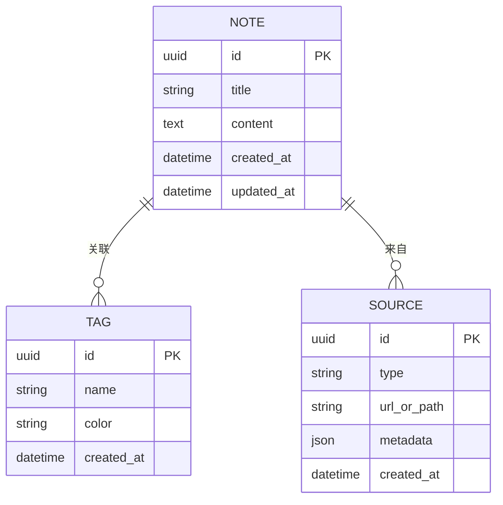
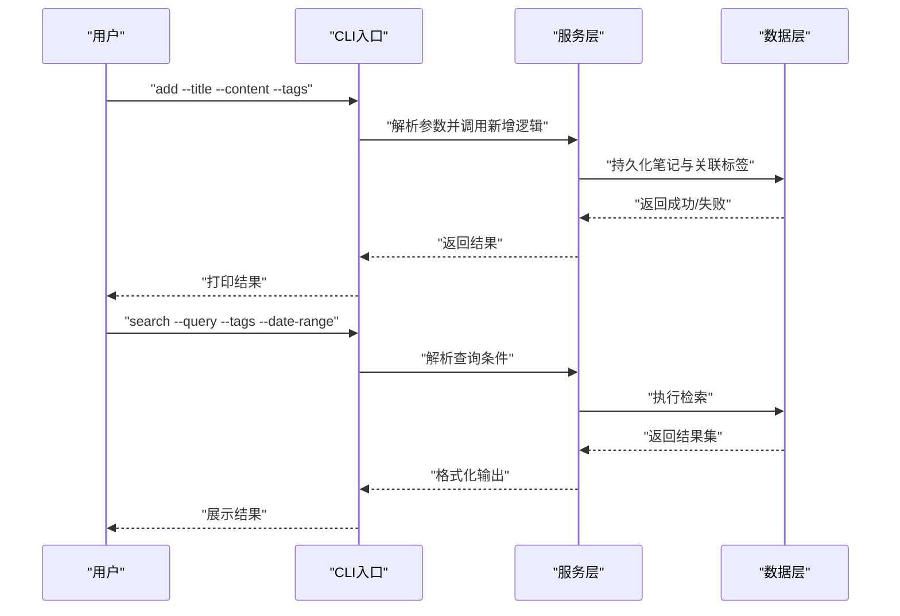
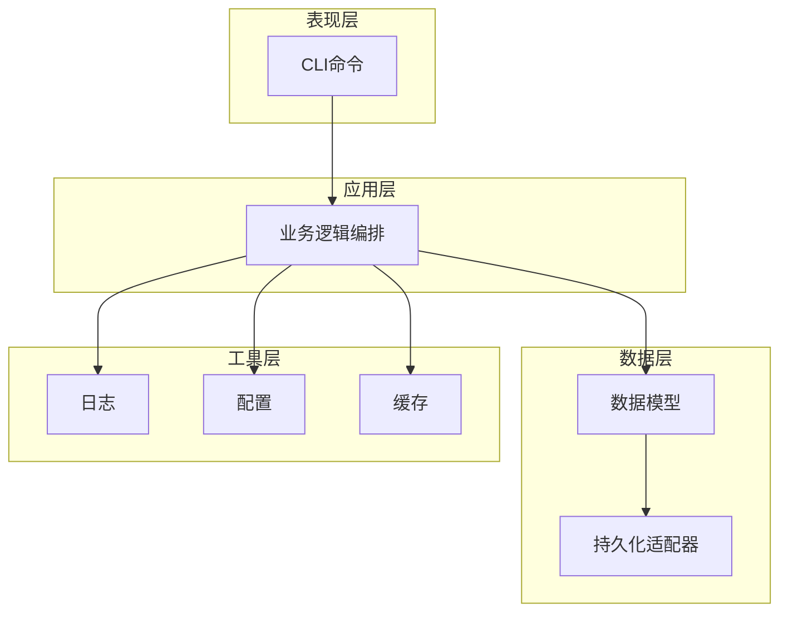

# 下一步开发建议

<cite>
**本文引用的文件**
- [README.md](file://README.md)
- [.gitignore](file://.gitignore)
</cite>

## 目录
1. [引言](#引言)
2. [项目现状与技术倾向](#项目现状与技术倾向)
3. [推荐的目录结构](#推荐的目录结构)
4. [依赖管理方案](#依赖管理方案)
5. [数据模型设计](#数据模型设计)
6. [基础CLI命令设计](#基础cli命令设计)
7. [架构概览](#架构概览)
8. [实施步骤与最佳实践](#实施步骤与最佳实践)
9. [故障排除指南](#故障排除指南)
10. [结论](#结论)

## 引言
本文件面向“SecondBrain”项目的初始开发者，提供从零到一的系统化开发路径建议。目标是在现有空置仓库基础上，快速建立可维护的工程化结构，明确数据模型与CLI能力，并为未来扩展（如AI自动化）预留接口。通过遵循本指南，开发者可以以较低的学习成本和试错成本，完成项目的基础骨架搭建。

## 项目现状与技术倾向
- 当前仓库状态：仅包含项目说明与通用忽略规则，尚未包含任何源码或配置文件。
- 技术倾向线索：
  - 明确支持 Poetry 与 PDM 的锁定文件与配置文件条目，表明倾向于现代化Python包管理工具。
  - 提供 Ruff 缓存目录忽略规则，暗示未来将引入代码质量与格式化工具链。
  - 包含 Abstra 目录忽略规则，提示未来可能集成AI自动化流程。
  - 同时保留了传统依赖管理方式（如 .env、.venv 等虚拟环境标识）的忽略规则，便于兼容多种工作流。

章节来源
- file://README.md#L1-L3
- file://.gitignore#L103-L110
- file://.gitignore#L111-L119
- file://.gitignore#L191-L193
- file://.gitignore#L178-L183

## 推荐的目录结构
为满足“src/、notes/、config/、docs/”等目录的组织需求，建议采用以下结构：
- src/：存放核心应用代码与模块
- notes/：存放笔记数据（可选，用于演示或本地存储）
- config/：存放配置文件（如数据库连接、默认设置等）
- docs/：存放项目文档与设计说明
- 其他根级文件：README.md、pyproject.toml（或 requirements.txt）、.gitignore 等

该结构兼顾了模块化、可扩展性与可维护性，便于后续引入测试、CI/CD与文档生成工具。

## 依赖管理方案
根据.gitignore中的条目，建议优先采用现代Python包管理工具：
- Poetry 或 PDM：两者均在忽略规则中有明确标注，适合长期维护与跨平台一致性。
- 锁定文件与配置文件：建议纳入版本控制，确保团队协作时的可复现性。
- 进阶工具：Ruff 可作为静态检查与格式化工具，配合缓存目录忽略规则使用。

实施要点
- 在项目初始化阶段确定单一包管理器（Poetry或PDM），避免混用导致锁文件冲突。
- 将锁定文件与配置文件纳入版本控制，保证构建一致性。
- 随着项目演进，逐步引入Ruff以统一代码风格与质量门禁。

章节来源
- file://.gitignore#L103-L110
- file://.gitignore#L111-L119
- file://.gitignore#L191-L193

## 数据模型设计
为支撑“笔记”类应用的核心能力，建议设计如下基础实体与关系：
- Note（笔记）
  - 字段：唯一标识、标题、正文、创建时间、更新时间、标签集合、来源信息等
  - 关系：多对多（标签）、一对多（来源）
- Tag（标签）
  - 字段：唯一标识、名称、颜色、创建时间等
  - 关系：多对多（笔记）
- Source（来源）
  - 字段：唯一标识、类型（网页、应用、剪贴板等）、URL/路径、元数据等
  - 关系：一对多（笔记）

复杂度与性能考量
- 查询与索引：对常用查询字段（如创建时间、标签名）建立索引，提升检索效率。
- 存储策略：可采用轻量级嵌入式数据库（如SQLite）作为默认后端，便于单机部署与迁移。
- 扩展性：为未来引入全文检索（如Whoosh或Tantivy）预留接口。

## 基础CLI命令设计
为实现“新增、检索、导出”的核心能力，建议提供以下CLI命令：
- add：新增笔记（支持从不同来源导入）
- search：按关键词、标签、时间范围等条件检索
- export：导出为指定格式（如Markdown、JSON）

命令交互与处理流程
- add：解析输入参数与来源，写入数据层，返回结果与提示
- search：构建查询条件，执行检索，输出结果列表
- export：根据导出格式生成文件，保存至指定位置

## 架构概览
整体采用分层架构，职责清晰、耦合度低：
- 表现层：CLI命令与可选Web界面
- 应用层：业务逻辑编排与校验
- 数据层：持久化与查询抽象
- 工具层：日志、配置、缓存与外部集成

## 实施步骤与最佳实践
- 第一步：初始化项目与包管理器
  - 选择 Poetry 或 PDM，生成项目配置文件
  - 将锁定文件纳入版本控制
- 第二步：建立目录结构与基础配置
  - 创建 src/、notes/、config/、docs/ 目录
  - 初始化默认配置文件与日志配置
- 第三步：定义数据模型与数据访问层
  - 设计实体与关系，实现ORM或数据适配器
  - 建立索引与查询接口
- 第四步：开发基础CLI命令
  - 实现 add/search/export 命令
  - 添加参数解析与错误处理
- 第五步：引入代码质量工具
  - 配置 Ruff 并在CI中启用
  - 统一代码风格与静态检查
- 第六步：规划AI自动化集成
  - 依据 .gitignore 中的 Abstra 条目，预留自动化流程入口
  - 为未来接入AI功能（如智能分类、摘要生成）准备接口

章节来源
- file://.gitignore#L103-L110
- file://.gitignore#L111-L119
- file://.gitignore#L178-L183
- file://.gitignore#L191-L193

## 故障排除指南
常见问题与解决思路
- 锁定文件冲突：若同时使用 Poetry 与 PDM，需统一为一种工具并清理另一方的锁定文件
- 虚拟环境隔离：确保 .venv/.env 等环境变量不被提交，使用 .gitignore 规则屏蔽
- 缓存目录影响：Ruff 缓存目录应忽略，避免污染版本库
- AI自动化目录：Abstra 目录为本地状态，不应纳入版本控制

章节来源
- file://.gitignore#L138-L146
- file://.gitignore#L191-L193
- file://.gitignore#L178-L183

## 结论
通过遵循本指南，开发者可以在极短时间内完成SecondBrain项目的工程化起步：确立现代化依赖管理、建立清晰的目录结构、设计可扩展的数据模型，并实现基础CLI能力。在此基础上，可逐步引入代码质量工具与AI自动化能力，持续提升项目的可维护性与智能化水平。