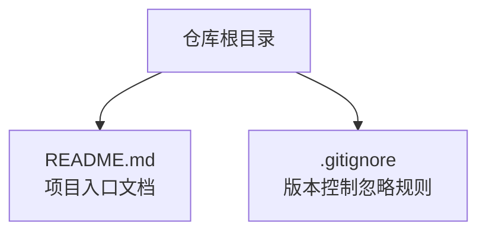
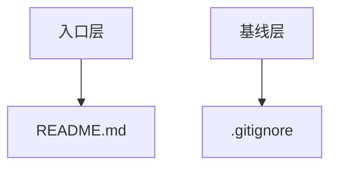
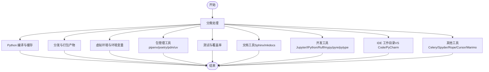
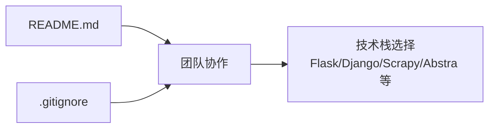

# 文件说明

<cite>
**本文引用的文件**
- [.gitignore](file://.gitignore)
- [README.md](file://README.md)
</cite>

## 目录
1. [引言](#引言)
2. [项目结构](#项目结构)
3. [核心组件](#核心组件)
4. [架构总览](#架构总览)
5. [详细组件分析](#详细组件分析)
6. [依赖分析](#依赖分析)
7. [性能考虑](#性能考虑)
8. [故障排查指南](#故障排查指南)
9. [结论](#结论)
10. [附录](#附录)

## 引言
本仓库目前仅包含两个根级文件：README.md 和 .gitignore。它们共同构成了项目的初始工程规范与入门说明：
- README.md 作为项目入口文档，提供项目名称与简要描述“外挂大脑，积累平日的见闻”，体现项目的核心理念是帮助用户构建个人知识体系与日常见闻的沉淀。
- .gitignore 则定义了版本控制中应忽略的文件与目录，覆盖 Python 编译产物、虚拟环境、包管理工具锁文件、测试与文档工具、Jupyter Notebook、以及主流 IDE 的工作目录，体现出良好的工程化基础与对多技术栈的前瞻支持。

尽管当前仓库尚未包含实际业务代码，但通过这两个文件，可以清晰地看到项目在工程规范与未来技术栈选择上的铺垫。

## 项目结构
仓库采用极简结构，仅包含两个文件：
- 根目录下存在一个 Markdown 文档用于项目介绍
- 根目录下存在一个忽略规则文件，用于统一管理版本控制中的排除项

**章节来源**
- file://README.md#L1-L3
- file://.gitignore#L1-L208

## 核心组件
本节聚焦两个文件的设计意图与作用范围：

- README.md
  - 作为项目入口文档，承担以下职责：
    - 明确项目名称，便于识别与检索
    - 提供简洁的项目描述，传达“外挂大脑，积累平日的见闻”的理念，强调知识积累与个人知识库建设
  - 该描述体现了项目面向个人知识管理（Second Brain）的定位，为后续功能规划与文档撰写奠定基调

- .gitignore
  - 作为工程规范的基础文件，覆盖以下类别：
    - Python 编译产物与缓存：避免将字节码、缓存目录等纳入版本控制
    - 分发与打包产物：排除 dist、build 等分发目录，保持仓库整洁
    - 虚拟环境与环境变量：忽略常见虚拟环境路径与环境配置文件
    - 包管理工具：针对 pipenv、poetry、pdm、uv 等锁文件与配置文件给出注释说明，体现对多生态的支持
    - 测试与覆盖率：排除 pytest、tox、coverage 等测试相关产物
    - 文档工具：Sphinx、mkdocs 等文档构建产物
    - 开发工具：Jupyter Notebook、IPython、Ruff、mypy、pyre、pytype 等
    - IDE 工作目录：对 VS Code、PyCharm 等 IDE 的工作区目录进行忽略，避免将编辑器特定配置提交到仓库
    - 其他：Celery、SageMath、Spyder、Rope、Cursor、Marimo 等工具的工作目录或产物

  - 这些规则共同构成一套完善的工程化基线，为后续引入 Flask、Django、Scrapy、Abstra 等技术栈提供兼容性保障。

**章节来源**
- file://README.md#L1-L3
- file://.gitignore#L1-L208

## 架构总览
从工程实践角度，两个文件共同构成了项目的“入口与基线”：
- README.md 作为“入口”，指引使用者理解项目目标与定位
- .gitignore 作为“基线”，确保团队协作时的版本控制一致性与可维护性

[本图为概念性示意，不直接映射具体源码文件，故不提供图表来源]

## 详细组件分析

### README.md 组件分析
- 设计意图
  - 以简洁明了的方式呈现项目名称与核心理念，便于新成员快速理解项目价值
  - 为后续扩展文档（如使用说明、贡献指南、技术选型说明）提供锚点
- 结构与内容
  - 第一行：项目标题，用于仓库识别
  - 第二行：项目描述，体现“外挂大脑，积累平日的见闻”的知识管理理念
- 影响与意义
  - 为后续引入技术栈（如 Flask、Django、Scrapy、Abstra）提供统一的语义背景
  - 有助于在团队内形成一致的认知与沟通基础

**章节来源**
- file://README.md#L1-L3

### .gitignore 组件分析
- 设计意图
  - 建立统一的版本控制排除规则，避免无关文件污染仓库历史
  - 面向多技术栈与多工具链的兼容性，降低协作成本
- 内容结构与分类
  - Python 编译与缓存：排除 __pycache__、*.pyc 等
  - 分发与打包：排除 build、dist、wheel 等目录
  - 虚拟环境与环境：忽略 .venv、.env、venv 等
  - 包管理工具：对 pipenv、poetry、pdm、uv 的锁文件与配置文件进行注释说明
  - 测试与覆盖率：排除 pytest、tox、coverage 等产物
  - 文档工具：Sphinx、mkdocs 构建产物
  - 开发工具：Jupyter Notebook、IPython、Ruff、mypy、pyre、pytype 等
  - IDE 工作目录：对 VS Code、PyCharm 等 IDE 的工作区进行忽略
  - 其他：Celery、Spyder、Rope、Cursor、Marimo 等工具产物
- 技术栈预示
  - 包管理工具注释与忽略规则表明项目具备采用 pipenv、poetry、pdm、uv 的能力
  - 对 Flask、Django、Scrapy、Abstra 的忽略条目暗示未来可能引入这些技术栈
  - 当前虽无实际代码，但已为后续开发打下工程化基础

**章节来源**
- file://.gitignore#L1-L208

## 依赖分析
- 两个文件之间的关系
  - README.md 与 .gitignore 在工程实践中相互补充：前者提供语义入口，后者提供工程基线
  - 二者均服务于“如何正确参与与维护该项目”的目标
- 外部依赖与影响
  - .gitignore 中对多种包管理工具与 IDE 的忽略规则，间接反映了项目对多生态工具链的兼容性需求
  - 对 Flask、Django、Scrapy、Abstra 的忽略条目，为后续技术选型预留空间

[本图为概念性示意，不直接映射具体源码文件，故不提供图表来源]

**章节来源**
- file://README.md#L1-L3
- file://.gitignore#L1-L208

## 性能考虑
- 版本控制性能
  - 合理的忽略规则可显著减少仓库体积与克隆时间，提升协作效率
  - 排除大型缓存与临时文件，有助于保持仓库健康状态
- 协作效率
  - 统一的忽略规则减少因 IDE 或工具差异导致的冲突
  - 对包管理工具锁文件的注释说明，有助于团队在不同工具间切换时保持一致性

[本节为通用建议，不直接分析具体文件，故不提供章节来源]

## 故障排查指南
- 常见问题与对策
  - 忽略规则未生效：检查是否在正确的目录层级添加忽略规则；确认 .gitignore 是否被正确提交
  - 锁文件误提交：若使用 pipenv、poetry、pdm、uv，请遵循各自的推荐实践，必要时在 .gitignore 中明确排除
  - IDE 工作目录污染：对 VS Code、PyCharm 等 IDE 的工作目录进行忽略，避免将编辑器特定配置提交到仓库
  - 虚拟环境误提交：确保 .venv、.env 等虚拟环境路径被忽略
- 参考规则
  - Python 编译与缓存、分发与打包、测试与覆盖率、文档工具、开发工具、IDE 工作目录等忽略规则均可在 .gitignore 中找到对应条目

**章节来源**
- file://.gitignore#L1-L208

## 结论
- README.md 以简洁方式明确了项目名称与核心理念，为后续文档与功能扩展提供入口
- .gitignore 以系统化的忽略规则为基础，覆盖 Python 生态的编译产物、虚拟环境、包管理工具、测试与文档工具、Jupyter Notebook 以及主流 IDE 的工作目录，体现出良好的工程规范与对多技术栈的前瞻支持
- 尽管当前仓库尚无实际代码，但通过这两个文件，项目已在工程化与技术选型上做好了充分准备，为后续引入 Flask、Django、Scrapy、Abstra 等技术栈提供了坚实基础

[本节为总结性内容，不直接分析具体文件，故不提供章节来源]

## 附录
- 术语说明
  - 第二脑（Second Brain）：一种个人知识管理系统，强调通过外部工具辅助记忆与知识组织
- 参考文件
  - README.md：项目入口文档
  - .gitignore：版本控制忽略规则

**章节来源**
- file://README.md#L1-L3
- file://.gitignore#L1-L208