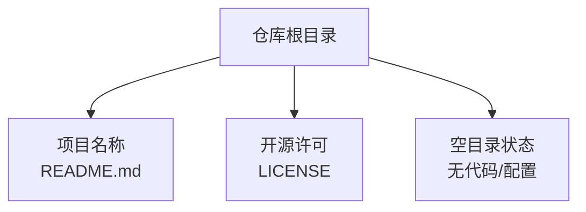
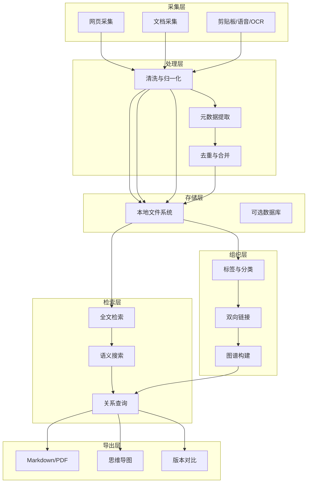
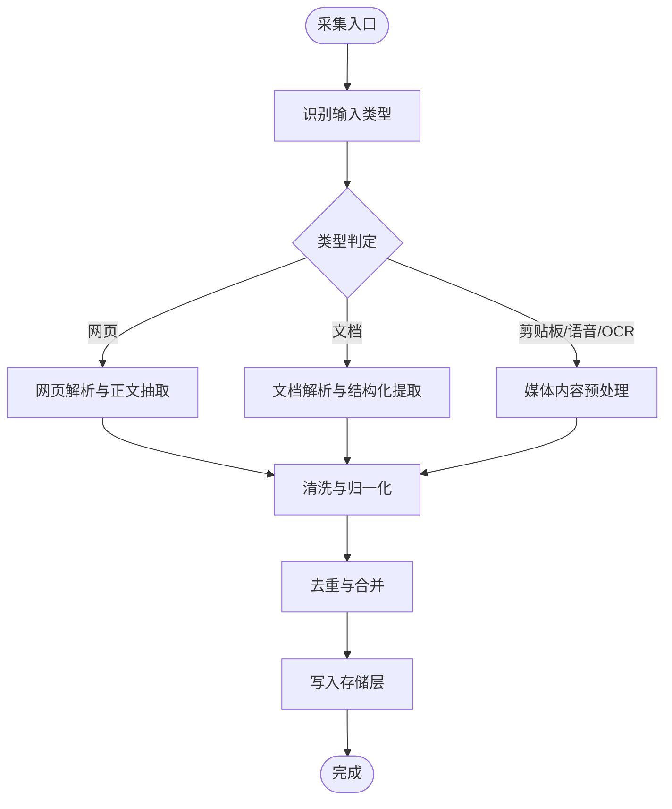
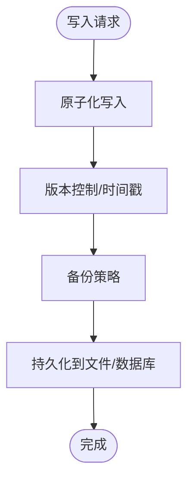
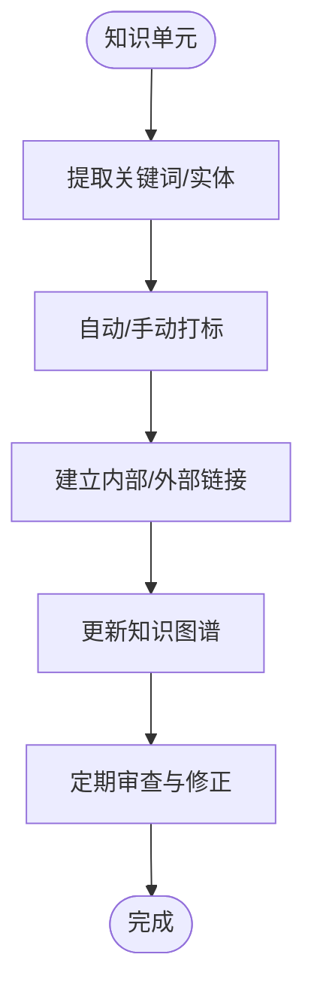
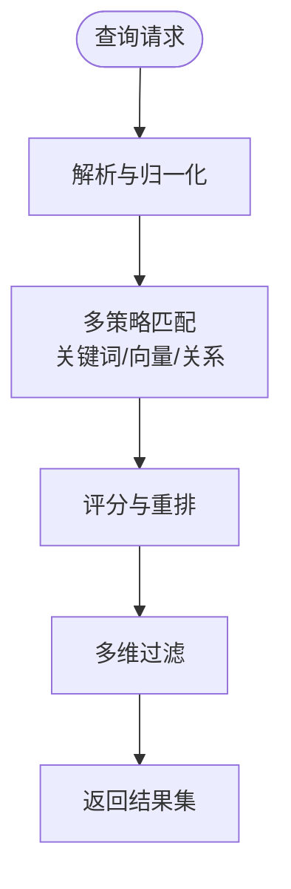
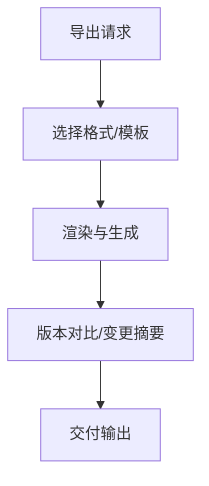
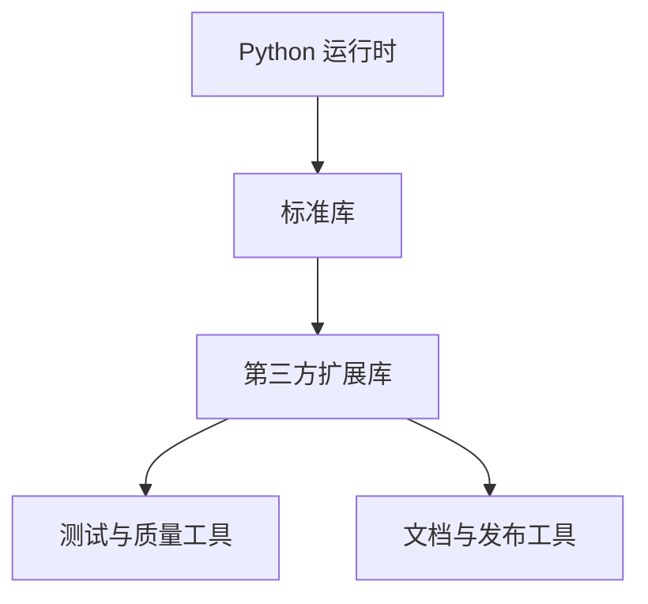

# 项目简介

<cite>
**本文引用的文件**
- [README.md](file://README.md)
- [LICENSE](file://LICENSE)
</cite>

## 目录
1. [引言](#引言)
2. [项目结构](#项目结构)
3. [核心组件](#核心组件)
4. [架构总览](#架构总览)
5. [详细组件分析](#详细组件分析)
6. [依赖分析](#依赖分析)
7. [性能考虑](#性能考虑)
8. [故障排查指南](#故障排查指南)
9. [结论](#结论)
10. [附录](#附录)

## 引言
SecondBrain 是一个“外挂大脑”式的知识管理与个人思维增强工具。它的核心理念是帮助用户系统化地积累、组织与检索日常见闻、学习内容与思考成果，形成可持续增长的个人知识库。项目当前处于初始阶段，仓库中仅包含项目名称、简要愿景与开源许可声明；但其设计目标明确：围绕知识采集、存储、组织、检索与导出等能力进行演进，逐步构建可扩展的知识管理基础设施。

在方法论层面，SecondBrain 的设计与实践可与多种知识管理范式协同，例如：
- PARA（项目导向的组织法）：强调按项目、上下文、类型与资源维度组织知识，便于快速定位与复用。
- Zettelkasten（德语“小纸条”）：强调原子化笔记与链接式思维，通过双向链接建立知识网络，促进深度思考与跨领域整合。

这些范式为后续功能扩展提供了清晰的组织思路与实践路径，使 SecondBrain 不仅是一个“存储器”，更是一个“思维放大器”。

对于不同背景的用户：
- 初学者：可从“见闻积累—分类整理—定期回顾”的最小可行流程开始，逐步引入 PARA 或 Zettelkasten 的组织策略。
- 有经验的开发者：可基于 Python 生态与模块化架构，扩展采集器（如网页抓取、剪贴板监听）、存储层（本地文件/数据库）、索引与检索引擎、以及导出与可视化能力，实现从“个人知识库”到“智能知识工作流”的跃迁。

本节为概念性介绍，不直接分析具体源码文件，故无“章节来源”。

## 项目结构
当前仓库结构简洁，采用极简初始化方式，便于聚焦核心目标与快速迭代：
- 根目录包含项目名称与愿景说明，以及开源许可声明。
- 未包含任何代码文件或配置文件，表明项目仍处于早期规划与孵化阶段。

图表来源
- [README.md](file://README.md#L1-L3)
- [LICENSE](file://LICENSE#L1-L202)

章节来源
- [README.md](file://README.md#L1-L3)
- [LICENSE](file://LICENSE#L1-L202)

## 核心组件
由于项目尚处初始阶段，尚未包含具体实现代码，因此核心组件以“概念性组件”呈现，用于指导后续开发与功能落地。以下组件为第二脑计划的未来蓝图，旨在支撑知识采集、存储、组织、检索与导出的全链路闭环。

- 知识采集器（Collector）
  - 职责：从多源输入采集信息，包括但不限于网页、文档、剪贴板、语音转文字、图片 OCR 等。
  - 关键点：统一入口、标准化元数据、去重与归一化处理。
- 存储层（Storage）
  - 职责：持久化知识单元（如笔记、卡片、片段），支持本地文件系统与可选数据库后端。
  - 关键点：原子化写入、版本控制、备份与迁移策略。
- 组织与标签（Organization & Tagging）
  - 职责：依据 PARA/Zettelkasten 等范式对知识进行分类、打标与链接。
  - 关键点：可组合的标签体系、双向链接与图谱构建。
- 检索引擎（Search Engine）
  - 职责：提供全文检索、语义搜索与关系查询，支持关键词、标签、时间范围与来源过滤。
  - 关键点：倒排索引、向量检索与评分排序。
- 导出与可视化（Export & Visualization）
  - 职责：将知识导出为 Markdown、PDF、思维导图等格式，并提供基础可视化。
  - 关键点：模板化导出、增量导出与版本对比。
- 工作流编排（Workflow Orchestrator）
  - 职责：自动化采集、清洗、标注与分发任务，支持定时与事件触发。
  - 关键点：任务队列、失败重试与可观测性。

章节来源
- [README.md](file://README.md#L1-L3)

## 架构总览
下图展示了 SecondBrain 的概念性架构：从采集入口到存储、组织、检索与导出的完整闭环。该图为概念示意，用于帮助理解各组件之间的职责边界与交互关系。

本图为概念性架构示意，不直接映射到具体源码文件，故无“图表来源”。

## 详细组件分析
本节从“采集—存储—组织—检索—导出”的视角，对各组件进行深入拆解，帮助读者理解每个环节的关键挑战与实现要点。

### 采集器（Collector）
- 输入来源：网页、文档、剪贴板、语音转文字、图片 OCR 等。
- 处理重点：统一入口、标准化元数据（标题、作者、来源、时间戳、标签）、去重与归一化。
- 扩展建议：插件化采集器、增量采集与增量索引、失败重试与幂等处理。

本图为概念性流程示意，不直接映射到具体源码文件，故无“图表来源”。

### 存储层（Storage）
- 设计目标：支持本地文件系统与可选数据库，兼顾易用性与扩展性。
- 关键点：原子化写入、版本控制、备份与迁移策略、并发安全与事务一致性。
- 建议：以 JSON/Markdown 为主、SQLite/PostgreSQL 为辅，逐步引入向量数据库与全文索引。

本图为概念性流程示意，不直接映射到具体源码文件，故无“图表来源”。

### 组织与标签（Organization & Tagging）
- 设计目标：支持 PARA/Zettelkasten 等范式，提供可组合的标签体系与双向链接。
- 关键点：标签冲突处理、链接一致性校验、图谱更新与缓存。
- 建议：引入轻量图数据库或内存图模型，支持拓扑查询与可视化。

本图为概念性流程示意，不直接映射到具体源码文件，故无“图表来源”。

### 检索引擎（Search Engine）
- 设计目标：提供全文检索、语义搜索与关系查询，支持多维过滤与排序。
- 关键点：倒排索引、向量检索、评分与重排、缓存与增量更新。
- 建议：结合 BM25、词嵌入与图遍历，实现“关键词+语义+关系”的混合检索。

本图为概念性流程示意，不直接映射到具体源码文件，故无“图表来源”。

### 导出与可视化（Export & Visualization）
- 设计目标：将知识导出为 Markdown、PDF、思维导图等格式，并提供基础可视化。
- 关键点：模板化导出、增量导出、版本对比与差异展示。
- 建议：提供 CLI 与 Web UI 双通道，支持批量导出与自定义模板。

本图为概念性流程示意，不直接映射到具体源码文件，故无“图表来源”。

## 依赖分析
当前仓库未包含第三方依赖声明，但基于项目愿景与未来功能规划，建议采用如下依赖策略：
- Python 生态：以标准库为基础，按需引入第三方库（如文件处理、正则表达式、JSON 序列化、数据库驱动、向量检索与图计算等）。
- 开发与测试：引入单元测试框架、覆盖率工具与静态分析工具，确保代码质量与可维护性。
- 文档与发布：使用文档生成工具与打包工具，便于社区协作与版本发布。

本图为概念性依赖示意，不直接映射到具体源码文件，故无“图表来源”。

## 性能考虑
- I/O 与并发：采用异步 I/O 与线程池，避免阻塞；对高频操作（如去重、索引）进行缓存与批处理。
- 存储与索引：优先本地文件系统，配合倒排索引与向量索引；对大文件与高并发场景引入分片与只读副本。
- 检索效率：对常用查询建立预计算索引；对语义搜索引入近似最近邻算法；对关系查询进行图遍历优化。
- 可观测性：埋点关键指标（吞吐、延迟、错误率），并提供健康检查与告警机制。

本节为通用性能建议，不直接分析具体源码文件，故无“章节来源”。

## 故障排查指南
- 采集失败
  - 排查网络连通性、代理设置与目标站点反爬策略。
  - 检查输入类型识别与解析器兼容性。
- 存储异常
  - 检查磁盘空间、权限与文件锁；必要时启用重试与回滚。
  - 对数据库连接与事务进行健康检查。
- 检索不准
  - 校验索引完整性与更新频率；调整评分权重与过滤条件。
  - 对语义模型进行版本管理与 A/B 测试。
- 导出问题
  - 检查模板语法与变量绑定；对大文档进行分块导出与进度反馈。

本节为通用故障排查建议，不直接分析具体源码文件，故无“章节来源”。

## 结论
SecondBrain 以“外挂大脑”为核心理念，致力于帮助用户系统化地积累、组织与检索日常见闻与思考成果。当前项目处于初始阶段，仓库简洁明了，为后续功能扩展预留了充分空间。未来可围绕采集、存储、组织、检索与导出五大能力，结合 PARA 与 Zettelkasten 等方法论，逐步构建可扩展、可演进的知识管理基础设施。对于初学者，建议从最小可行流程入手；对于有经验的开发者，可在 Python 生态与模块化架构基础上，持续扩展与优化。

本节为总结性内容，不直接分析具体源码文件，故无“章节来源”。

## 附录
- 许可证信息：项目采用 Apache License 2.0，允许自由使用、修改与再分发，但需保留版权声明与许可证声明。
- 版本与变更：当前仓库未包含版本历史与变更记录，建议在后续开发中引入变更日志与版本标签管理。

章节来源
- [LICENSE](file://LICENSE#L1-L202)