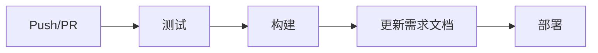

# 自动化测试与需求文档更新指南

## 概述

本项目已配置完整的自动化测试和需求文档更新流程，确保每次代码更新后自动运行测试并更新文档。

## 目录

- [测试框架](#测试框架)
- [测试用例](#测试用例)
- [Git Hooks](#git-hooks)
- [CI/CD 流程](#cicd-流程)
- [需求文档自动更新](#需求文档自动更新)
- [使用指南](#使用指南)

## 测试框架

### 技术栈

- **测试框架**: Mocha
- **断言库**: Chai
- **HTTP 测试**: Supertest
- **覆盖率**: c8
- **代码检查**: ESLint

### 配置文件

- [.mocharc.json](.mocharc.json) - Mocha 配置
- [.env.test](.env.test) - 测试环境变量
- [test/setup.js](test/setup.js) - 测试初始化

## 测试用例

### 目录结构

```
test/
├── setup.js                    # 测试环境初始化
├── api/                        # API 测试
│   ├── contents.test.js        # 内容管理 API
│   ├── tags.test.js            # 标签管理 API
│   └── auth.test.js            # 认证 API
├── services/                   # 服务层测试
│   ├── ai-service.test.js      # AI 服务
│   └── sync-service.test.js    # 同步服务
└── frontend/                   # 前端测试
    └── components.test.js      # 组件测试
```

### 测试覆盖范围

#### API 测试 ([test/api/](test/api/))

- **内容管理** ([contents.test.js](test/api/contents.test.js))
  - ✅ 获取内容列表（分页、筛选、搜索）
  - ✅ 创建内容（验证、AI 分析）
  - ✅ 获取单个内容
  - ✅ 更新内容（时间戳验证）
  - ✅ 删除内容（软删除）
  - ✅ 快速保存和批量保存

- **标签管理** ([tags.test.js](test/api/tags.test.js))
  - ✅ 获取标签列表（含统计）
  - ✅ 创建标签（防重复）
  - ✅ 更新标签
  - ✅ 删除标签

- **认证** ([auth.test.js](test/api/auth.test.js))
  - ✅ 登录验证
  - ✅ 登出功能
  - ✅ 字段验证

#### 服务层测试 ([test/services/](test/services/))

- **AI 服务** ([ai-service.test.js](test/services/ai-service.test.js))
  - ✅ 内容分析
  - ✅ 每日总结生成
  - ✅ 模型降级机制
  - ✅ 错误处理

- **同步服务** ([sync-service.test.js](test/services/sync-service.test.js))
  - ✅ 配置验证
  - ✅ 双向同步
  - ✅ 冲突解决
  - ✅ 批量处理

#### 前端测试 ([test/frontend/](test/frontend/))

- **组件测试** ([components.test.js](test/frontend/components.test.js))
  - ✅ ContentCard 组件
  - ✅ TagList 组件
  - ✅ SearchBar 组件
  - ✅ ContentForm 组件
  - ✅ Pinia Store 测试

## Git Hooks

### Pre-commit Hook

**位置**: [.git/hooks/pre-commit](.git/hooks/pre-commit)

**功能**:
1. 运行 ESLint 代码检查
2. 运行快速测试（API 测试）
3. 检查 TODO/FIXME 标记

**触发时机**: 每次 `git commit` 前

**Windows 版本**: [.git/hooks/pre-commit.bat](.git/hooks/pre-commit.bat)

### Pre-push Hook

**位置**: [.git/hooks/pre-push](.git/hooks/pre-push)

**功能**:
1. 运行完整测试套件
2. 检查测试覆盖率
3. 验证构建成功

**触发时机**: 每次 `git push` 前

**Windows 版本**: [.git/hooks/pre-push.bat](.git/hooks/pre-push.bat)

### 启用 Hooks

```bash
# Linux/Mac
chmod +x .git/hooks/pre-commit
chmod +x .git/hooks/pre-push

# Windows
# Hooks 会自动执行 .bat 版本
```

## CI/CD 流程

### GitHub Actions 工作流

**配置文件**: [.github/workflows/ci-cd.yml](.github/workflows/ci-cd.yml)

### 工作流程



### 任务详情

#### 1. 测试任务 (test)

- **触发条件**: Push 或 PR 到 main/develop 分支
- **运行环境**: Ubuntu Latest
- **Node 版本**: 18.x, 20.x（矩阵测试）
- **步骤**:
  1. 检出代码
  2. 设置 Node.js 环境
  3. 安装依赖 (`npm ci`)
  4. 运行 ESLint
  5. 运行测试
  6. 生成覆盖率报告
  7. 上传到 Codecov

#### 2. 构建任务 (build)

- **依赖**: 测试任务通过
- **步骤**:
  1. 构建前端 (`npm run build`)
  2. 上传构建产物（保留 7 天）

#### 3. 更新需求文档 (update-requirements)

- **触发条件**: Push 到 main 分支
- **依赖**: 测试任务通过
- **步骤**:
  1. 运行需求文档更新脚本
  2. 自动提交文档变更
  3. 推送到仓库

#### 4. 部署任务 (deploy)

- **触发条件**: Push 到 main 分支
- **依赖**: 构建任务完成
- **步骤**:
  1. 下载构建产物
  2. 部署到服务器（需配置）

## 需求文档自动更新

### 更新脚本

**位置**: [scripts/update-requirements.js](scripts/update-requirements.js)

### 功能

1. **分析 Git 提交**
   - 获取最近 10 条提交
   - 解析提交消息（遵循 Conventional Commits）
   - 提取功能变更

2. **更新需求文档**
   - 自动添加更新日志
   - 按类型分组变更
   - 记录提交哈希和日期

3. **生成测试报告**
   - 运行完整测试套件
   - 解析测试结果
   - 生成 Markdown 报告

### 提交消息规范

遵循 [Conventional Commits](https://www.conventionalcommits.org/) 规范:

```
<type>(<scope>): <description>

[optional body]

[optional footer]
```

**类型 (type)**:
- `feat`: 新功能
- `fix`: 修复 Bug
- `docs`: 文档更新
- `style`: 代码格式（不影响功能）
- `refactor`: 重构
- `test`: 测试相关
- `chore`: 构建/工具相关

**示例**:
```bash
git commit -m "feat(contents): 添加批量导入功能"
git commit -m "fix(sync): 修复飞书同步冲突问题"
git commit -m "docs(api): 更新 API 文档"
```

### 输出文件

- [docs/requirements.md](docs/requirements.md) - 需求文档
- [docs/test-report.md](docs/test-report.md) - 测试报告

## 使用指南

### 本地开发

#### 1. 安装依赖

```bash
npm install
```

#### 2. 运行测试

```bash
# 运行所有测试
npm test

# 运行特定测试
npm run test:api          # 仅 API 测试
npm run test:services     # 仅服务层测试

# 监听模式
npm run test:watch

# 生成覆盖率报告
npm run test:coverage
```

#### 3. 代码检查

```bash
# 运行 ESLint
npm run lint
```

#### 4. 手动更新需求文档

```bash
npm run update-requirements
```

### 提交代码

#### 标准流程

```bash
# 1. 添加变更
git add .

# 2. 提交（会自动触发 pre-commit hook）
git commit -m "feat(feature): 添加新功能"

# 3. 推送（会自动触发 pre-push hook）
git push origin main
```

#### 跳过 Hooks（不推荐）

```bash
# 跳过 pre-commit
git commit --no-verify -m "message"

# 跳过 pre-push
git push --no-verify
```

### CI/CD 流程

#### 查看构建状态

1. 访问 GitHub Actions 页面
2. 查看最新工作流运行状态
3. 点击查看详细日志

#### 查看测试报告

- **在线**: GitHub Actions 工作流详情
- **本地**: `docs/test-report.md`

#### 查看覆盖率

- **Codecov**: 自动上传到 Codecov（需配置）
- **本地**: 运行 `npm run test:coverage` 后查看 `coverage/` 目录

## 故障排除

### 测试失败

**问题**: 测试无法通过

**解决方案**:
1. 查看测试输出，定位失败的测试用例
2. 检查测试环境配置 (`.env.test`)
3. 确保数据库文件存在 (`data/test.db`)
4. 运行 `npm run test:watch` 进行调试

### Hooks 不执行

**问题**: Git hooks 没有运行

**解决方案**:
```bash
# Linux/Mac: 添加执行权限
chmod +x .git/hooks/pre-commit
chmod +x .git/hooks/pre-push

# Windows: 确保 .bat 文件存在
# Git 会自动查找并执行 .bat 版本
```

### CI/CD 失败

**问题**: GitHub Actions 工作流失败

**解决方案**:
1. 查看 Actions 日志，定位失败步骤
2. 检查环境变量配置
3. 确保所有依赖都在 `package.json` 中
4. 本地运行相同命令验证

### 需求文档未更新

**问题**: 提交后需求文档没有自动更新

**解决方案**:
1. 检查提交消息是否符合规范
2. 确保推送到 `main` 分支
3. 查看 GitHub Actions 日志
4. 手动运行 `npm run update-requirements`

## 最佳实践

### 测试编写

1. **遵循 AAA 模式**
   - Arrange（准备）
   - Act（执行）
   - Assert（断言）

2. **测试命名**
   - 使用描述性名称
   - 说明测试的预期行为
   - 示例: `应该返回内容列表`

3. **测试隔离**
   - 每个测试独立运行
   - 不依赖其他测试的状态
   - 使用 `beforeEach` 和 `afterEach` 清理

4. **Mock 外部依赖**
   - 不依赖真实的 API Key
   - 使用 `skip()` 跳过需要外部服务的测试

### 提交规范

1. **原子提交**
   - 每次提交只包含一个逻辑变更
   - 便于回滚和代码审查

2. **清晰的提交消息**
   - 使用 Conventional Commits 格式
   - 描述"做了什么"和"为什么"

3. **频繁提交**
   - 完成一个小功能就提交
   - 不要积累太多变更

### CI/CD 优化

1. **缓存依赖**
   - GitHub Actions 已配置 npm 缓存
   - 加快构建速度

2. **并行执行**
   - 矩阵测试（多个 Node 版本）
   - 独立任务并行运行

3. **失败快速反馈**
   - 测试失败立即停止
   - 及时通知开发者

## 配置文件索引

### 测试相关
- [package.json](package.json) - 测试脚本和依赖
- [.mocharc.json](.mocharc.json) - Mocha 配置
- [.env.test](.env.test) - 测试环境变量
- [test/setup.js](test/setup.js) - 测试初始化

### Git Hooks
- [.git/hooks/pre-commit](.git/hooks/pre-commit) - 提交前检查
- [.git/hooks/pre-commit.bat](.git/hooks/pre-commit.bat) - Windows 版本
- [.git/hooks/pre-push](.git/hooks/pre-push) - 推送前检查
- [.git/hooks/pre-push.bat](.git/hooks/pre-push.bat) - Windows 版本

### CI/CD
- [.github/workflows/ci-cd.yml](.github/workflows/ci-cd.yml) - GitHub Actions 工作流

### 脚本
- [scripts/update-requirements.js](scripts/update-requirements.js) - 需求文档更新脚本

### 文档
- [docs/requirements.md](docs/requirements.md) - 需求文档
- [docs/test-report.md](docs/test-report.md) - 测试报告

## 扩展阅读

- [Mocha 文档](https://mochajs.org/)
- [Chai 断言库](https://www.chaijs.com/)
- [Supertest HTTP 测试](https://github.com/visionmedia/supertest)
- [GitHub Actions 文档](https://docs.github.com/en/actions)
- [Conventional Commits](https://www.conventionalcommits.org/)

## 更新日志

### 2026-01-20

**新增**:
- ✅ 完整的测试框架配置
- ✅ API 测试用例（内容、标签、认证）
- ✅ 服务层测试用例（AI、同步）
- ✅ 前端组件测试框架
- ✅ Git Hooks（pre-commit、pre-push）
- ✅ GitHub Actions CI/CD 工作流
- ✅ 需求文档自动更新脚本
- ✅ 测试报告生成器

**改进**:
- 📝 完善的自动化流程文档
- 🔧 跨平台支持（Linux/Mac/Windows）
- 📊 测试覆盖率报告

---

**维护者**: Second Brain 开发团队
**最后更新**: 2026-01-20
**版本**: 1.0.0
